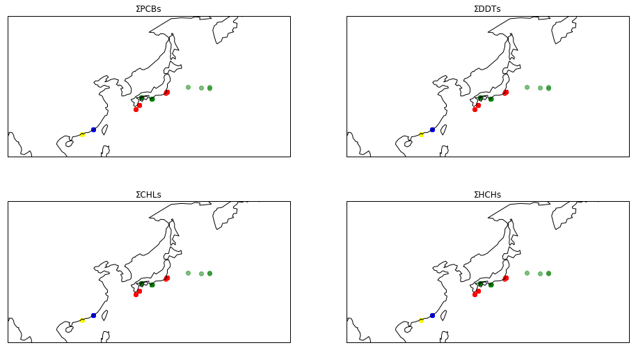

# Part 1 基本統計量とその可視化


## Chap.0 全体の流れ

<p>Part1では、ChemTHEATREに格納されているスナメリのデータを利用して、データの基本的な特性を見る基本統計量を分析し、箱ひげ図を利用して可視化する。</p>


## Chap.1 ライブラリの読み込み


```python
%matplotlib inline
import numpy as np # as np, as pdなどはプログラムで呼び出すときの省略名を設定している 
import pandas as pd # いちいちnumpyなどと都度入力するのがめんどうなので慣習としてこの様に記載される
import matplotlib.pyplot as plt
import seaborn as sns
```


<p>１行目は、可視化の際に出力されるグラフがJupyter Notebook内で表示する設定<sup><a href=#sup1>1</a></sup>である。２行目以降で、今回のコードで必要なライブラリを読み込む。いずれもAnacondaに標準でインストールされているライブラリである。<br>
具体的なライブラリの内容は以下の通りである。</p>


<table border="1" class="dataframe" style="font-size: 0.8rem">
  <tr>
    <th>ライブラリ</th>
    <th>概要</th>
    <th>今回の使用目的</th>
    <th>公式URL</th>
  </tr>
  <tr>
    <td align="left">NumPy</td>
    <td align="left">数値計算ライブラリ</td>
    <td align="left">統計処理上の数値計算に利用</td>
    <td align="left"><a href=https://www.numpy.org>https://www.numpy.org</a></td>
  </tr>
  <tr>
    <td align="left">pandas</td>
    <td align="left">データ分析ライブラリ</td>
    <td align="left">データ読み込みや整形に利用</td>
    <td align="left"><a href=https://pandas.pydata.org>https://pandas.pydata.org</a></td>
  </tr>
  <tr>
    <td align="left">Matplotlib</td>
    <td align="left">グラフ描画ライブラリ</td>
    <td align="left">データの可視化に利用</td>
    <td align="left"><a href=https://matplotlib.org>https://matplotlib.org</a></td>
  </tr>
  <tr>
    <td align="left">seaborn</td>
    <td align="left">統計データ可視化ライブラリ</td>
    <td align="left">データの可視化に利用</td>
    <td align="left"><a href=https://seaborn.pydata.org>https://seaborn.pydata.org</a></td>
  </tr>
</table>


## Chap.2 データの読み込み


<p>先述の通り、今回はスナメリ（<i>Neophocaena phocaenoides</i>）のデータを取り扱う。ChemTHEATREのSample Searchからスナメリに関するデータをTSV形式<sup><a href=#sup2>2</a></sup>でダウンロードする。ChemTHEATREのSample Searchのデータは、測定結果（measureddata）と採集標本（samples）の2種類あるが、今回はその両方を使用する。詳細はPart 0 のChap.4を参照すること。</p>

```python
data_file = "measureddata_20190826061813.tsv"    #変数に入力する文字列を、各自のmeasureddataのtsvファイル名に変更する
chem = pd.read_csv(data_file, delimiter="\t")
chem = chem.drop(["ProjectID", "ScientificName", "RegisterDate", "UpdateDate"], axis=1)    #後でsamplesと結合する際に重複する列の削除
```


```python
sample_file = "samples_20190826061810.tsv"    #変数に入力する文字列を、各自のsamplesのtsvファイル名に変更する
sample = pd.read_csv(sample_file, delimiter="\t")
```


<p>ダウンロードしたTSVファイルは、pandasの関数（read_csv）で読み込む。この際、各ファイルのパス（上セルでの"data_file"や"sample_file"）は、それぞれの環境に合わせたファイル名に変更する必要がある。サンプルコードでは、ノートブックと同じディレクトリにデータファイルがある環境で記述している。</p> 
## Chap.3 データの下処理


<p>今回扱うデータは、様々な化学物質の測定結果を一緒くたにしたものである。更に、測定結果と標本のデータがバラバラで存在している。つまり、このままでは扱いづらいので、扱いやすい形に整形する必要がある。具体的には下記の操作が必要である。</p>
<ol>
    <li>chemにsampleを結合させる。</li>
    <li>今回扱う化学物質の測定データのみを抽出する。</li>
    <li>可視化に不要な列を削除する。</li>
</ol>


### Sec.3-1 必要データの抽出


<p>まず、上で示した1.と2.について処理を行う。</p>
<p>結合については、各化学物質を測定した標本のデータフレーム（sample）を各化学物質のデータフレーム（chem）に付け加えるという作業である。ここでは、chemの各データが持つSampleIDに対応するsampleのデータをchemの右側にくっつけるという処理をする。</p>

```python
df = pd.merge(chem, sample, on="SampleID")
```


<p>今回扱うデータは、各化学物質がかなり細かく分類されている。それぞれの化学物質について計測結果を可視化してもよいが、今回は計測結果の概要をひと目で分かるように可視化したいので、化学物質を大まかに分類したときの各グループの合計値のデータを抽出する。</p>
<p>また、今回扱うデータには、2種類の異なる単位が混在している。異なる単位同士では、比較しても意味がないので、今回は単位ごとにデータを分割する。以下のコードではそれぞれの1行目でUnitを指定してlipid, wet換算のものを抽出した上で、その中でΣから始まる変数だけを抽出している。2行目ではΣから始まるものの、実際は化学物質濃度の合計値ではない変数をデータから削除している。</p>

```python
data_lipid = df[(df["Unit"] == "ng/g lipid") & df["ChemicalName"].str.startswith("Σ")]
data_lipid = data_lipid[(data_lipid["ChemicalName"] != "ΣOH-penta-PCB") & (data_lipid["ChemicalName"] != "ΣOH-hexa-PCB")
                        & (data_lipid["ChemicalName"] != "ΣOH-hepta-PCB") &  (data_lipid["ChemicalName"] != "ΣOH-octa-PCB")]
data_wet = df[(df["Unit"] == "ng/g wet") & df["ChemicalName"].str.startswith("Σ")]
data_wet = data_wet[(data_wet["ChemicalName"] != "ΣOH-penta-PCB") & (data_wet["ChemicalName"] != "ΣOH-hexa-PCB")
                    & (data_wet["ChemicalName"] != "ΣOH-hepta-PCB") &  (data_wet["ChemicalName"] != "ΣOH-octa-PCB")]
```


#### データの概形

<p>Sec.3-1で処理した結果（単位がng/g lipidの方のみ）である。不要なデータを削除したことで、6種の化学物質についての131のデータのみが抽出できた。</p>
```python
data_lipid
```


<table border="1" class="dataframe" style="font-size: 0.6rem">
  <thead>
    <tr style="text-align: left;">
      <th></th>
      <th>MeasuredID</th>
      <th>SampleID</th>
      <th>ChemicalID</th>
      <th>ChemicalName</th>
      <th>ExperimentID</th>
      <th>MeasuredValue</th>
      <th>AlternativeData</th>
      <th>Unit</th>
      <th>Remarks_x</th>
      <th>ProjectID</th>
      <th>...</th>
    </tr>
  </thead>
  <tbody>
    <tr>
      <th>4371</th>
      <td>24782</td>
      <td>SAA001903</td>
      <td>CH0000033</td>
      <td>ΣDDTs</td>
      <td>EXA000001</td>
      <td>68000.0</td>
      <td>NaN</td>
      <td>ng/g lipid</td>
      <td>NaN</td>
      <td>PRA000030</td>
      <td>...</td>
    </tr>
    <tr>
      <th>4372</th>
      <td>24768</td>
      <td>SAA001903</td>
      <td>CH0000096</td>
      <td>ΣPCBs</td>
      <td>EXA000001</td>
      <td>5700.0</td>
      <td>NaN</td>
      <td>ng/g lipid</td>
      <td>NaN</td>
      <td>PRA000030</td>
      <td>...</td>
    </tr>
    <tr>
      <th>4381</th>
      <td>24754</td>
      <td>SAA001903</td>
      <td>CH0000138</td>
      <td>ΣPBDEs</td>
      <td>EXA000001</td>
      <td>170.0</td>
      <td>NaN</td>
      <td>ng/g lipid</td>
      <td>NaN</td>
      <td>PRA000030</td>
      <td>...</td>
    </tr>
    <tr>
      <th>4385</th>
      <td>24902</td>
      <td>SAA001903</td>
      <td>CH0000142</td>
      <td>ΣHBCDs</td>
      <td>EXA000001</td>
      <td>5.6</td>
      <td>NaN</td>
      <td>ng/g lipid</td>
      <td>NaN</td>
      <td>PRA000030</td>
      <td>...</td>
    </tr>
    <tr>
      <th>4389</th>
      <td>24810</td>
      <td>SAA001903</td>
      <td>CH0000146</td>
      <td>ΣHCHs</td>
      <td>EXA000001</td>
      <td>1100.0</td>
      <td>NaN</td>
      <td>ng/g lipid</td>
      <td>NaN</td>
      <td>PRA000030</td>
      <td>...</td>
    </tr>
    <tr>
      <th>...</th>
      <td>...</td>
      <td>...</td>
      <td>...</td>
      <td>...</td>
      <td>...</td>
      <td>...</td>
      <td>...</td>
      <td>...</td>
      <td>...</td>
      <td>...</td>
      <td>...</td>
    </tr>
    <tr>
      <th>4812</th>
      <td>25125</td>
      <td>SAA001940</td>
      <td>CH0000152</td>
      <td>ΣCHLs</td>
      <td>EXA000001</td>
      <td>160.0</td>
      <td>NaN</td>
      <td>ng/g lipid</td>
      <td>NaN</td>
      <td>PRA000030</td>
      <td>...</td>
    </tr>
    <tr>
      <th>4816</th>
      <td>25112</td>
      <td>SAA001941</td>
      <td>CH0000033</td>
      <td>ΣDDTs</td>
      <td>EXA000001</td>
      <td>9400.0</td>
      <td>NaN</td>
      <td>ng/g lipid</td>
      <td>NaN</td>
      <td>PRA000030</td>
      <td>...</td>
    </tr>
    <tr>
      <th>4817</th>
      <td>25098</td>
      <td>SAA001941</td>
      <td>CH0000096</td>
      <td>ΣPCBs</td>
      <td>EXA000001</td>
      <td>1100.0</td>
      <td>NaN</td>
      <td>ng/g lipid</td>
      <td>NaN</td>
      <td>PRA000030</td>
      <td>...</td>
    </tr>
    <tr>
      <th>4818</th>
      <td>25140</td>
      <td>SAA001941</td>
      <td>CH0000146</td>
      <td>ΣHCHs</td>
      <td>EXA000001</td>
      <td>41.0</td>
      <td>NaN</td>
      <td>ng/g lipid</td>
      <td>NaN</td>
      <td>PRA000030</td>
      <td>...</td>
    </tr>
    <tr>
      <th>4819</th>
      <td>25126</td>
      <td>SAA001941</td>
      <td>CH0000152</td>
      <td>ΣCHLs</td>
      <td>EXA000001</td>
      <td>290.0</td>
      <td>NaN</td>
      <td>ng/g lipid</td>
      <td>NaN</td>
      <td>PRA000030</td>
      <td>...</td>
    </tr>
  </tbody>
</table>
<p>131 rows × 74 columns</p>


### Sec.3-2 不要な列の削除


<p>続いて、不要な列の削除を行う。一般に、情報量が同じなら、扱うデータは容量が小さい方が良いので、無駄なデータは削ったほうがよい。今回扱うデータフレームには、データのない空欄が多く存在する。これは、python上ではN/A（浮動小数点数）として扱われ、情報はないが容量はそれなりに消費する。したがって、データフレームからすべてN/Aの列（情報のない列）をまるごと削除する。</p>
```python
data_lipid = data_lipid.dropna(how='all', axis=1)
data_wet = data_wet.dropna(how='all', axis=1)
```


#### データの概形


<p>Sec.3-2の処理をした結果である。Sec.3-1の結果と比較して列の数（表の下に出るcolumnsの値）がかなり小さくなったことがわかる。</p>
```python
data_lipid
```


<table border="1" class="dataframe" style="font-size: 0.6rem">
  <thead>
    <tr style="text-align: left;">
      <th></th>
      <th>MeasuredID</th>
      <th>SampleID</th>
      <th>ChemicalID</th>
      <th>ChemicalName</th>
      <th>ExperimentID</th>
      <th>MeasuredValue</th>
      <th>Unit</th>
      <th>ProjectID</th>
      <th>SampleType</th>
      <th>TaxonomyID</th>
      <th>...</th>
    </tr>
  </thead>
  <tbody>
    <tr>
      <th>4371</th>
      <td>24782</td>
      <td>SAA001903</td>
      <td>CH0000033</td>
      <td>ΣDDTs</td>
      <td>EXA000001</td>
      <td>68000.0</td>
      <td>ng/g lipid</td>
      <td>PRA000030</td>
      <td>ST004</td>
      <td>34892</td>
      <td>...</td>
    </tr>
    <tr>
      <th>4372</th>
      <td>24768</td>
      <td>SAA001903</td>
      <td>CH0000096</td>
      <td>ΣPCBs</td>
      <td>EXA000001</td>
      <td>5700.0</td>
      <td>ng/g lipid</td>
      <td>PRA000030</td>
      <td>ST004</td>
      <td>34892</td>
      <td>...</td>
    </tr>
    <tr>
      <th>4381</th>
      <td>24754</td>
      <td>SAA001903</td>
      <td>CH0000138</td>
      <td>ΣPBDEs</td>
      <td>EXA000001</td>
      <td>170.0</td>
      <td>ng/g lipid</td>
      <td>PRA000030</td>
      <td>ST004</td>
      <td>34892</td>
      <td>...</td>
    </tr>
    <tr>
      <th>4385</th>
      <td>24902</td>
      <td>SAA001903</td>
      <td>CH0000142</td>
      <td>ΣHBCDs</td>
      <td>EXA000001</td>
      <td>5.6</td>
      <td>ng/g lipid</td>
      <td>PRA000030</td>
      <td>ST004</td>
      <td>34892</td>
      <td>...</td>
    </tr>
    <tr>
      <th>4389</th>
      <td>24810</td>
      <td>SAA001903</td>
      <td>CH0000146</td>
      <td>ΣHCHs</td>
      <td>EXA000001</td>
      <td>1100.0</td>
      <td>ng/g lipid</td>
      <td>PRA000030</td>
      <td>ST004</td>
      <td>34892</td>
      <td>...</td>
    </tr>
    <tr>
      <th>...</th>
      <td>...</td>
      <td>...</td>
      <td>...</td>
      <td>...</td>
      <td>...</td>
      <td>...</td>
      <td>...</td>
      <td>...</td>
      <td>...</td>
      <td>...</td>
      <td>...</td>
    </tr>
    <tr>
      <th>4812</th>
      <td>25125</td>
      <td>SAA001940</td>
      <td>CH0000152</td>
      <td>ΣCHLs</td>
      <td>EXA000001</td>
      <td>160.0</td>
      <td>ng/g lipid</td>
      <td>PRA000030</td>
      <td>ST004</td>
      <td>34892</td>
      <td>...</td>
    </tr>
    <tr>
      <th>4816</th>
      <td>25112</td>
      <td>SAA001941</td>
      <td>CH0000033</td>
      <td>ΣDDTs</td>
      <td>EXA000001</td>
      <td>9400.0</td>
      <td>ng/g lipid</td>
      <td>PRA000030</td>
      <td>ST004</td>
      <td>34892</td>
      <td>...</td>
    </tr>
    <tr>
      <th>4817</th>
      <td>25098</td>
      <td>SAA001941</td>
      <td>CH0000096</td>
      <td>ΣPCBs</td>
      <td>EXA000001</td>
      <td>1100.0</td>
      <td>ng/g lipid</td>
      <td>PRA000030</td>
      <td>ST004</td>
      <td>34892</td>
      <td>...</td>
    </tr>
    <tr>
      <th>4818</th>
      <td>25140</td>
      <td>SAA001941</td>
      <td>CH0000146</td>
      <td>ΣHCHs</td>
      <td>EXA000001</td>
      <td>41.0</td>
      <td>ng/g lipid</td>
      <td>PRA000030</td>
      <td>ST004</td>
      <td>34892</td>
      <td>...</td>
    </tr>
    <tr>
      <th>4819</th>
      <td>25126</td>
      <td>SAA001941</td>
      <td>CH0000152</td>
      <td>ΣCHLs</td>
      <td>EXA000001</td>
      <td>290.0</td>
      <td>ng/g lipid</td>
      <td>PRA000030</td>
      <td>ST004</td>
      <td>34892</td>
      <td>...</td>
    </tr>
  </tbody>
</table>
<p>131 rows × 37 columns</p>


## Chap.4 ΣDDTsの可視化


<p>Chap.3で処理したことで、6種類の化学物質について、2種の単位ごとのデータが準備できた。ここでは、まずΣDDTsのng/g lipidについて、データの散らばり具合を可視化する。</p>
### Sec.4-1 データの準備


<p>まず可視化するにあたって、data_lipidからΣDDTsのデータを抽出する。</p>
```python
data_ddt = data_lipid[data_lipid["ChemicalName"] == "ΣDDTs"]
ddt_vals = data_ddt.loc[:, "MeasuredValue"]
data_ddt
```


<table border="1" class="dataframe" style="font-size: 0.6rem">
  <thead>
    <tr style="text-align: left;">
      <th></th>
      <th>MeasuredID</th>
      <th>SampleID</th>
      <th>ChemicalID</th>
      <th>ChemicalName</th>
      <th>ExperimentID</th>
      <th>MeasuredValue</th>
      <th>Unit</th>
      <th>ProjectID</th>
      <th>SampleType</th>
      <th>TaxonomyID</th>
      <th>...</th>
    </tr>
  </thead>
  <tbody>
    <tr>
      <th>4371</th>
      <td>24782</td>
      <td>SAA001903</td>
      <td>CH0000033</td>
      <td>ΣDDTs</td>
      <td>EXA000001</td>
      <td>68000.0</td>
      <td>ng/g lipid</td>
      <td>PRA000030</td>
      <td>ST004</td>
      <td>34892</td>
      <td>...</td>
    </tr>
    <tr>
      <th>4401</th>
      <td>24783</td>
      <td>SAA001904</td>
      <td>CH0000033</td>
      <td>ΣDDTs</td>
      <td>EXA000001</td>
      <td>140000.0</td>
      <td>ng/g lipid</td>
      <td>PRA000030</td>
      <td>ST004</td>
      <td>34892</td>
      <td>...</td>
    </tr>
    <tr>
      <th>4431</th>
      <td>24784</td>
      <td>SAA001905</td>
      <td>CH0000033</td>
      <td>ΣDDTs</td>
      <td>EXA000001</td>
      <td>140000.0</td>
      <td>ng/g lipid</td>
      <td>PRA000030</td>
      <td>ST004</td>
      <td>34892</td>
      <td>...</td>
    </tr>
    <tr>
      <th>4461</th>
      <td>24785</td>
      <td>SAA001906</td>
      <td>CH0000033</td>
      <td>ΣDDTs</td>
      <td>EXA000001</td>
      <td>130000.0</td>
      <td>ng/g lipid</td>
      <td>PRA000030</td>
      <td>ST004</td>
      <td>34892</td>
      <td>...</td>
    </tr>
    <tr>
      <th>4491</th>
      <td>24786</td>
      <td>SAA001907</td>
      <td>CH0000033</td>
      <td>ΣDDTs</td>
      <td>EXA000001</td>
      <td>280000.0</td>
      <td>ng/g lipid</td>
      <td>PRA000030</td>
      <td>ST004</td>
      <td>34892</td>
      <td>...</td>
    </tr>
  </tbody>
</table>
<p>5 rows × 37 columns</p>

### Sec.4-2 基本統計量


<p>Sec.4-1でデータが抽出できたので、このデータセットの特徴を掴むために、基本統計量の算出をする。基本統計量は、データセットを要約するいくつかの統計量である。今回は、データ総数、平均、標準偏差、第1四分位数、中央値、第3四分位数、最小値、最大値を計算する。</p>
```python
count = ddt_vals.count()
mean = ddt_vals.mean()
std = ddt_vals.std()
q1 = ddt_vals.quantile(0.25)
med = ddt_vals.median()
q3 = ddt_vals.quantile(0.75)
min = ddt_vals.min()
max = ddt_vals.max()
count, mean, std, q1, med, q3, min, max
```


    (24, 102137.5, 81917.43357743236, 41750.0, 70500.0, 140000.0, 9400.0, 280000.0)


<p>上セルでは、基本統計量を各個に計算したが、pandasには基本統計量をまとめて出す関数がある。</p>

```python
avgs = ddt_vals.describe()
avgs
```


    count        24.000000
    mean     102137.500000
    std       81917.433577
    min        9400.000000
    25%       41750.000000
    50%       70500.000000
    75%      140000.000000
    max      280000.000000
    Name: MeasuredValue, dtype: float64


### Sec.4-3 jitter plot


<p>データの散らばり具合を可視化する方法として、全データをプロットする散布図がある (江口: これは散布図ではなくjitter plotでは？）。Pythonではseabornのstripplot関数を使うことで簡単にjitter plotを描くことができる。jitter plotは点どうしが重なってしまう場合にも、点にゆらぎを加えることでそれぞれの天を見やすく記述できる良い可視化手法の1つである。</p>

```python
fig = plt.figure()
ax = fig.add_subplot(1,1,1)
sns.stripplot(x="ChemicalName", y="MeasuredValue", data=data_ddt, color='black', ax=ax)  # jitterplotの作図
ax.set_ylabel("ng/g lipid")
plt.show()
```


### Sec.4-4 箱ひげ図


<p>Sec.4-3とは異なり、基本統計量でデータセットを要約したものをプロットするのが、箱ひげ図である。箱ひげ図は、seabornのboxplot関数で描画できる。ここでは先程のjitter plotに箱ひげ図を重ね書きすることで、データの分布をより把握しやすい図を出力している。</p>

```python
fig = plt.figure()
ax = fig.add_subplot(1,1,1)
sns.stripplot(x="ChemicalName", y="MeasuredValue", data=data_lipid[data_lipid["ChemicalName"] == "ΣDDTs"], color='black', ax=ax) # jitterplotの作図
sns.boxplot(x="ChemicalName", y="MeasuredValue", data=data_lipid[data_lipid["ChemicalName"] == "ΣDDTs"], ax=ax) # 箱ひげ図の作図
ax.set_ylabel("ng/g lipid")
plt.show()
```





## Chap.5 スナメリ（<i>Neophocaena phocaenoides</i>）の各化学物質データの可視化


<p>Chap.4ではΣDDTsの値のみを可視化した。それを応用して、data_lipidとdata_wetのデータを可視化する。</p>
### Sec.5-1 箱ひげ図（Sec.4-4の応用）


<p>まず、data_lipidのデータについて、Sec.4-4と同じようにグラフを描画する。stripplot・boxplot関数はパラメータxに代入する列名でデータを自動的に分類する機能があるので、ひとまとめにしたデータをそのままパラメータdataに代入すれば良い。</p>
```python
fig = plt.figure()
ax = fig.add_subplot(1,1,1)
sns.stripplot(x="ChemicalName", y="MeasuredValue", data=data_lipid, color='black', ax=ax) # jitterplotの作図
sns.boxplot(x="ChemicalName", y="MeasuredValue", data=data_lipid, ax=ax) # 箱ひげ図の作図
ax.set_ylabel("ng/g lipid")
plt.show()
```


### Sec.5-2 Sec.5-1の改善


<p>上のグラフでは、ΣDDTsのばらつきが大きいので、y軸の間隔が広くなっている。したがって、残りの5種類のグラフが潰れており、見えにくい。そこで、データの値の対数を取ることで、グラフを見やすくする。</p>
<p>まず、対数を取るにあたって、0の対数は取れないので、データセットに0が含まれるか確認する。in文を使うことで、該当する値の有無がTRUE / FALSEで返される。</p>

```python
0 in data_lipid.loc[:, "MeasuredValue"].values
```


    False


<p>上セルでデータセットに０が含まれないことがわかったので、そのまま対数の値を取れる。</p>
```python
data_lipid.loc[:, "MeasuredValue"] = data_lipid.loc[:, "MeasuredValue"].apply(np.log10)
```


    C:\Users\masah\Anaconda3\lib\site-packages\pandas\core\indexing.py:543: SettingWithCopyWarning: 
    A value is trying to be set on a copy of a slice from a DataFrame.
    Try using .loc[row_indexer,col_indexer] = value instead
    
    See the caveats in the documentation: http://pandas.pydata.org/pandas-docs/stable/indexing.html#indexing-view-versus-copy
      self.obj[item] = s


```python
fig = plt.figure()
ax = fig.add_subplot(1,1,1)
sns.stripplot(x="ChemicalName", y="MeasuredValue", data=data_lipid, color='black', ax=ax) # jitterplotの作図
sns.boxplot(x="ChemicalName", y="MeasuredValue", data=data_lipid, ax=ax) # 箱ひげ図の作図
ax.set_ylabel("log(ng/g) lipid")
plt.show()
```


<p>data_wetについても同様に、可視化する。まず、データセットに0が含まれる場合、最小値の1/2を代わりに代入する。その後、対数を取り、可視化する。</p>

```python
if 0 in data_wet.loc[:, "MeasuredValue"].values:
    data_wet["MeasuredValue"].replace(0, data_wet[data_wet["MeasuredValue"] != 0].loc[:, "MeasuredValue"].values.min() / 2) #最小値の1/2を代入
else:
    pass
data_lipid.loc[:, "MeasuredValue"] = data_lipid["MeasuredValue"].apply(np.log10)
data_lipid.loc[:, "Unit"] = "log(ng/g lipid)"
```


```python
fig = plt.figure()
ax = fig.add_subplot(1,1,1)
sns.stripplot(x="ChemicalName", y="MeasuredValue", data=data_lipid, color='black', ax=ax)
sns.boxplot(x="ChemicalName", y="MeasuredValue", data=data_lipid, ax=ax)
ax.set_ylabel("log(ng/g lipid)")
plt.show()
```


## 脚注

<p><sup id=sup1>1</sup>　「マジックコマンド」と呼ばれるJuyterNotebookの機能であり、一般のpythonコードでは利用できないので注意が必要である。</p>
<p><sup id=sup2>2</sup>　tab-separated valuesの略。TAB文字（キーボードの左端にある）でデータを区切ったファイル形式である。表の形をしたデータを保持するのに向いている。類似のファイル形式に、CSV（comma-separated valuesの略。「,（コンマ）」で区切る）がある。

