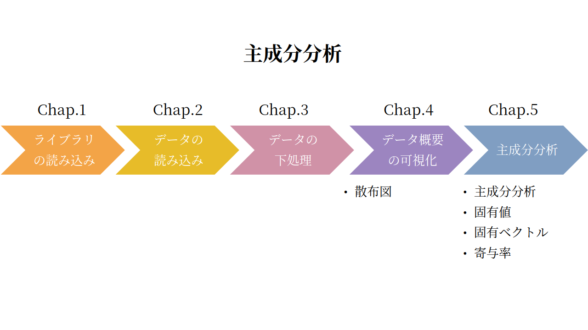
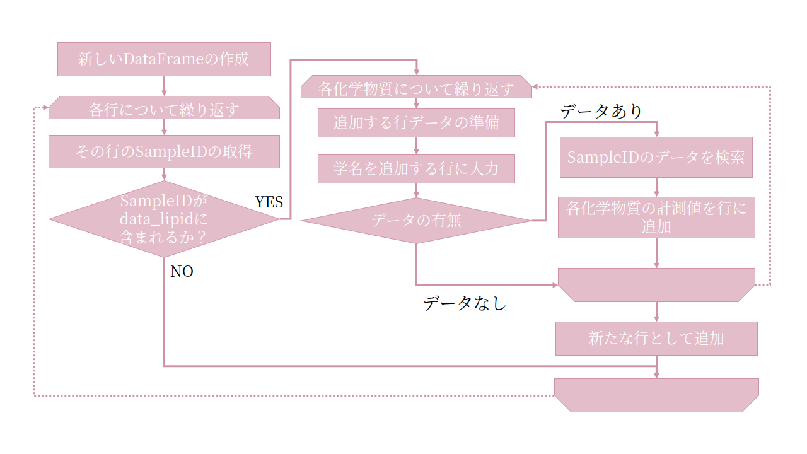

# Part 3 主成分分析


## Chap.0 全体の流れ


<p>Part3では、主成分分析を行う。主成分分析とは、多くの説明変数<sup><a href=#sup1>1</a></sup>を、より数少ない指標や合成変数<sup><a href=#sup2>2</a></sup>で表すことである。つまり、統計的にデータを要約することで、直感的に理解しづらい多次元のデータ全体の傾向や雰囲気を掴むということである。例えば、体型を表す指標として身長と体重の2変数があるが、これらを1変数のBMIにまとめるようなものである。</p>
<p>ChemTHEATREのデータの場合、一つのサンプルに対して、いくつかの化学物質の濃度を計測している事が多い。つまり、各サンプルについて説明変数が複数あるということである。今回は、各説明変数の持つ情報を可能な限り損なわないよう主成分分析し、データの概要を掴むことを目指す。</p>



## Chap.1 ライブラリの読み込み


```python
%matplotlib inline
import numpy as np
import pandas as pd
from matplotlib import pyplot as plt
import matplotlib.ticker as ticker
import sklearn
from sklearn.decomposition import PCA
```


<p>まず、必要なライブラリを読み込む。1行目は例によって、Jupyter Notebook内にmatplotlibで描画したグラフを表示するマジックコマンドである。<br>
続いて、2行目以降が必要なライブラリである。なお、これらのライブラリはAnacondaにインストールされているものである。<br>
  今回主成分分析に利用するscikit-learnは、オープンソース<sup><a href=#sup3>3</a></sup>の機械学習ライブラリであり、他に分類<sup><a href=#sup4>4</a></sup>や回帰<sup><a href=#sup4>4</a></sup>、クラスタリング<sup><a href=#4>4</a></sup>などの様々なアルゴリズムも実装されている。</p>
<table style="font-size: 0.8rem">
  <tr>
    <th>ライブラリ</th>
    <th>概要</th>
    <th>今回の使用目的</th>
    <th>公式URL</th>
  </tr>
  <tr>
    <td align="left">NumPy</td>
    <td align="left">数値計算ライブラリ</td>
    <td align="left">統計処理上の数値計算に利用</td>
    <td align="left"><a href=https://www.numpy.org>https://www.numpy.org</a></td>
  </tr>
  <tr>
    <td align="left">pandas</td>
    <td align="left">データ分析ライブラリ</td>
    <td align="left">データ読み込みや整形に利用</td>
    <td align="left"><a href=https://pandas.pydata.org>https://pandas.pydata.org</a></td>
  </tr>
  <tr>
    <td align="left">Matplotlib</td>
    <td align="left">グラフ描画ライブラリ</td>
    <td align="left">データの可視化に利用</td>
    <td align="left"><a href=https://matplotlib.org>https://matplotlib.org</a></td>
  </tr>
  <tr>
    <td align="left">scikit-learn</td>
    <td align="left">機械学習ライブラリ</td>
    <td align="left">主成分分析（PCA）の実装に利用</td>
    <td align="left"><a href=https://scikit-learn.org>https://scikit-learn.org</a></td>
  </tr>
</table>


## Chap.2 データの読み込み


<p>Chap.1で必要なライブラリが読み込めたので、次に今回取り扱うデータを準備する。今回取り扱うデータは、スナメリ（<i>Neophocaena phocaenoides</i>）、スジイルカ（<i>Stenella coeruleoalba</i>）、カズハゴンドウ（<i>Peponocephala electra</i>）の三種である。いずれもChemTHEATREのSample Searchからmeasureddataとsamplesをダウンロードして、Part1やPart2と同様に読み込む。<br>
</p>
<p>各3つずつのファイルの読み込みが成功したら、measureddata、samplesのそれぞれ3つのファイルを後の処理で使いやすいよう、結合してひとまとめにする。この際、Pandasのconcat関数を使用すると便利である。パラメーターのignore_indexをTrueにすると、結合するPandasのDataFrame<sup><a href=#sup5>5</a></sup>の列番号が振り直される。</p>

```python
data_file1 = "measureddata_20191004033314.tsv"    #変数に入力する文字列を、各自のmeasureddataのtsvファイル名に変更する
data_file2 = "measureddata_20191004033325.tsv"    #変数に入力する文字列を、各自のmeasureddataのtsvファイル名に変更する
data_file3 = "measureddata_20191004033338.tsv"    #変数に入力する文字列を、各自のmeasureddataのtsvファイル名に変更する

data1 = pd.read_csv(data_file1, delimiter="\t")
data2 = pd.read_csv(data_file2, delimiter="\t")
data3 = pd.read_csv(data_file3, delimiter="\t")

data = pd.concat([data1, data2, data3], ignore_index=True)    #Pandasのconcat関数で結合する
data
```


<table border="1" class="dataframe" style="font-size: 0.6rem">
  <thead>
    <tr style="text-align: left;">
      <th></th>
      <th>MeasuredID</th>
      <th>ProjectID</th>
      <th>SampleID</th>
      <th>ScientificName</th>
      <th>ChemicalID</th>
      <th>ChemicalName</th>
      <th>ExperimentID</th>
      <th>MeasuredValue</th>
      <th>AlternativeData</th>
      <th>...</th>
    </tr>
  </thead>
  <tbody>
    <tr>
      <th>0</th>
      <td>80</td>
      <td>PRA000002</td>
      <td>SAA000087</td>
      <td>Neophocaena phocaenoides</td>
      <td>CH0000154</td>
      <td>TBT</td>
      <td>EXA000001</td>
      <td>170.0000</td>
      <td>NaN</td>
      <td>...</td>
    </tr>
    <tr>
      <th>1</th>
      <td>81</td>
      <td>PRA000002</td>
      <td>SAA000087</td>
      <td>Neophocaena phocaenoides</td>
      <td>CH0000155</td>
      <td>DBT</td>
      <td>EXA000001</td>
      <td>220.3591</td>
      <td>NaN</td>
      <td>...</td>
    </tr>
    <tr>
      <th>2</th>
      <td>82</td>
      <td>PRA000002</td>
      <td>SAA000087</td>
      <td>Neophocaena phocaenoides</td>
      <td>CH0000156</td>
      <td>MBT</td>
      <td>EXA000001</td>
      <td>44.5445</td>
      <td>NaN</td>
      <td>...</td>
    </tr>
    <tr>
      <th>3</th>
      <td>83</td>
      <td>PRA000002</td>
      <td>SAA000087</td>
      <td>Neophocaena phocaenoides</td>
      <td>CH0000157</td>
      <td>ΣBTs</td>
      <td>EXA000001</td>
      <td>434.9036</td>
      <td>NaN</td>
      <td>...</td>
    </tr>
    <tr>
      <th>4</th>
      <td>84</td>
      <td>PRA000002</td>
      <td>SAA000087</td>
      <td>Neophocaena phocaenoides</td>
      <td>CH0000158</td>
      <td>TPT</td>
      <td>EXA000001</td>
      <td>12.9220</td>
      <td>NaN</td>
      <td>...</td>
    </tr>
    <tr>
      <th>...</th>
      <td>...</td>
      <td>...</td>
      <td>...</td>
      <td>...</td>
      <td>...</td>
      <td>...</td>
      <td>...</td>
      <td>...</td>
      <td>...</td>
      <td>...</td>
    </tr>
    <tr>
      <th>9774</th>
      <td>24272</td>
      <td>PRA000036</td>
      <td>SAA002163</td>
      <td>Peponocephala electra</td>
      <td>CH0000151</td>
      <td>cis-nonachlor</td>
      <td>EXA000001</td>
      <td>170.0000</td>
      <td>NaN</td>
      <td>...</td>
    </tr>
    <tr>
      <th>9775</th>
      <td>24056</td>
      <td>PRA000036</td>
      <td>SAA002163</td>
      <td>Peponocephala electra</td>
      <td>CH0000152</td>
      <td>ΣCHLs</td>
      <td>EXA000001</td>
      <td>1100.0000</td>
      <td>NaN</td>
      <td>...</td>
    </tr>
    <tr>
      <th>9776</th>
      <td>24376</td>
      <td>PRA000036</td>
      <td>SAA002163</td>
      <td>Peponocephala electra</td>
      <td>CH0000153</td>
      <td>HCB</td>
      <td>EXA000001</td>
      <td>120.0000</td>
      <td>NaN</td>
      <td>...</td>
    </tr>
    <tr>
      <th>9777</th>
      <td>24646</td>
      <td>PRA000036</td>
      <td>SAA002163</td>
      <td>Peponocephala electra</td>
      <td>CH0000533</td>
      <td>TCPMe</td>
      <td>EXA000001</td>
      <td>6.1000</td>
      <td>NaN</td>
      <td>...</td>
    </tr>
    <tr>
      <th>9778</th>
      <td>24700</td>
      <td>PRA000036</td>
      <td>SAA002163</td>
      <td>Peponocephala electra</td>
      <td>CH0000534</td>
      <td>TCPMOH</td>
      <td>EXA000001</td>
      <td>16.0000</td>
      <td>NaN</td>
      <td>...</td>
    </tr>
  </tbody>
</table>
<p>9779 rows × 13 columns</p>


```python
sample_file1 = "samples_20191004033311.tsv"    #変数に入力する文字列を、各自のsamplesのtsvファイル名に変更する
sample_file2 = "samples_20191004033323.tsv"    #変数に入力する文字列を、各自のsamplesのtsvファイル名に変更する
sample_file3 = "samples_20191004033334.tsv"    #変数に入力する文字列を、各自のsamplesのtsvファイル名に変更する

sample1 = pd.read_csv(sample_file1, delimiter="\t")    
sample2 = pd.read_csv(sample_file2, delimiter="\t")
sample3 = pd.read_csv(sample_file3, delimiter="\t")

sample = pd.concat([sample1, sample2, sample3], ignore_index=True)    #Pandasのconcat関数で結合する
sample
```


<table border="1" class="dataframe" style="font-size: 0.6rem">
  <thead>
    <tr style="text-align: left;">
      <th></th>
      <th>ProjectID</th>
      <th>SampleID</th>
      <th>SampleType</th>
      <th>TaxonomyID</th>
      <th>UniqCodeType</th>
      <th>UniqCode</th>
      <th>SampleName</th>
      <th>ScientificName</th>
      <th>CommonName</th>
      <th>CollectionYear</th>
      <th>...</th>
    </tr>
  </thead>
  <tbody>
    <tr>
      <th>0</th>
      <td>PRA000002</td>
      <td>SAA000087</td>
      <td>ST004</td>
      <td>34892</td>
      <td>es-BANK</td>
      <td>EW00884</td>
      <td>NaN</td>
      <td>Neophocaena phocaenoides</td>
      <td>Finless porpoises</td>
      <td>1996</td>
      <td>...</td>
    </tr>
    <tr>
      <th>1</th>
      <td>PRA000002</td>
      <td>SAA000088</td>
      <td>ST004</td>
      <td>34892</td>
      <td>es-BANK</td>
      <td>EW00812</td>
      <td>NaN</td>
      <td>Neophocaena phocaenoides</td>
      <td>Finless porpoises</td>
      <td>1999</td>
      <td>...</td>
    </tr>
    <tr>
      <th>2</th>
      <td>PRA000002</td>
      <td>SAA000089</td>
      <td>ST004</td>
      <td>34892</td>
      <td>es-BANK</td>
      <td>EW00873</td>
      <td>NaN</td>
      <td>Neophocaena phocaenoides</td>
      <td>Finless porpoises</td>
      <td>1995</td>
      <td>...</td>
    </tr>
    <tr>
      <th>3</th>
      <td>PRA000002</td>
      <td>SAA000090</td>
      <td>ST004</td>
      <td>34892</td>
      <td>es-BANK</td>
      <td>EW04787</td>
      <td>NaN</td>
      <td>Neophocaena phocaenoides</td>
      <td>Finless porpoises</td>
      <td>2000</td>
      <td>...</td>
    </tr>
    <tr>
      <th>4</th>
      <td>PRA000002</td>
      <td>SAA000091</td>
      <td>ST004</td>
      <td>34892</td>
      <td>es-BANK</td>
      <td>EW00867</td>
      <td>NaN</td>
      <td>Neophocaena phocaenoides</td>
      <td>Finless porpoises</td>
      <td>1998</td>
      <td>...</td>
    </tr>
    <tr>
      <th>...</th>
      <td>...</td>
      <td>...</td>
      <td>...</td>
      <td>...</td>
      <td>...</td>
      <td>...</td>
      <td>...</td>
      <td>...</td>
      <td>...</td>
      <td>...</td>
      <td>...</td>
    </tr>
    <tr>
      <th>312</th>
      <td>PRA000036</td>
      <td>SAA002159</td>
      <td>ST004</td>
      <td>103596</td>
      <td>es-BANK</td>
      <td>EW04779</td>
      <td>060301-1</td>
      <td>Peponocephala electra</td>
      <td>Melon-headed whale</td>
      <td>2006</td>
      <td>...</td>
    </tr>
    <tr>
      <th>313</th>
      <td>PRA000036</td>
      <td>SAA002160</td>
      <td>ST004</td>
      <td>103596</td>
      <td>es-BANK</td>
      <td>EW00115</td>
      <td>M32625</td>
      <td>Peponocephala electra</td>
      <td>Melon-headed whale</td>
      <td>2001</td>
      <td>...</td>
    </tr>
    <tr>
      <th>314</th>
      <td>PRA000036</td>
      <td>SAA002161</td>
      <td>ST004</td>
      <td>103596</td>
      <td>es-BANK</td>
      <td>EW00122</td>
      <td>M32633</td>
      <td>Peponocephala electra</td>
      <td>Melon-headed whale</td>
      <td>2001</td>
      <td>...</td>
    </tr>
    <tr>
      <th>315</th>
      <td>PRA000036</td>
      <td>SAA002162</td>
      <td>ST004</td>
      <td>103596</td>
      <td>es-BANK</td>
      <td>EW00116</td>
      <td>M32626</td>
      <td>Peponocephala electra</td>
      <td>Melon-headed whale</td>
      <td>2001</td>
      <td>...</td>
    </tr>
    <tr>
      <th>316</th>
      <td>PRA000036</td>
      <td>SAA002163</td>
      <td>ST004</td>
      <td>103596</td>
      <td>es-BANK</td>
      <td>EW00117</td>
      <td>M32627</td>
      <td>Peponocephala electra</td>
      <td>Melon-headed whale</td>
      <td>2001</td>
      <td>...</td>
    </tr>
  </tbody>
</table>
<p>317 rows × 66 columns</p>


## Chap.3 データの下処理


<p>データの読み込みが終了したら、次はデータの分析ができる形に下処理をする。まずmeasureddataから今回利用するデータを取り出すところから始める。<br>今回利用するのは、スナメリ、スジイルカ、カズハゴンドウの3種についての、5種類の化学物質（ΣPCBs, ΣDDTs, ΣPBDEs, ΣCHLs, ΣHCHs）である。</p>
<p>最初に、単位が[ng/g lipid]のデータを抽出する。これは、Part 1でも述べたように単位が異なるデータ同士は、単純に比較できないからである。<br>
その次に、化学物質名が先述の5種のいずれかであるデータを抽出して、reset_indexメソッドを利用して行番号を振り直す。</p>


```python
data_lipid = data[(data["Unit"] == "ng/g lipid")]
data_lipid = data_lipid[(data_lipid["ChemicalName"] == "ΣPCBs") | (data_lipid["ChemicalName"] == "ΣDDTs") |
                        (data_lipid["ChemicalName"] == "ΣPBDEs") |  (data_lipid["ChemicalName"] == "ΣCHLs") |
                        (data_lipid["ChemicalName"] == "ΣHCHs")]
data_lipid = data_lipid.reset_index(drop=True)
data_lipid[data_lipid["SampleID"] == "SAA001941"]    #SampleIDがSAA001941のデータ一覧
```


<table border="1" class="dataframe" style="font-size: 0.6rem">
  <thead>
    <tr style="text-align: left;">
      <th></th>
      <th>MeasuredID</th>
      <th>ProjectID</th>
      <th>SampleID</th>
      <th>ScientificName</th>
      <th>ChemicalID</th>
      <th>ChemicalName</th>
      <th>ExperimentID</th>
      <th>MeasuredValue</th>
      <th>AlternativeData</th>
      <th>...</th>
    </tr>
  </thead>
  <tbody>
    <tr>
      <th>115</th>
      <td>25112</td>
      <td>PRA000030</td>
      <td>SAA001941</td>
      <td>Neophocaena phocaenoides</td>
      <td>CH0000033</td>
      <td>ΣDDTs</td>
      <td>EXA000001</td>
      <td>9400.0</td>
      <td>NaN</td>
      <td>...</td>
    </tr>
    <tr>
      <th>116</th>
      <td>25098</td>
      <td>PRA000030</td>
      <td>SAA001941</td>
      <td>Neophocaena phocaenoides</td>
      <td>CH0000096</td>
      <td>ΣPCBs</td>
      <td>EXA000001</td>
      <td>1100.0</td>
      <td>NaN</td>
      <td>...</td>
    </tr>
    <tr>
      <th>117</th>
      <td>25140</td>
      <td>PRA000030</td>
      <td>SAA001941</td>
      <td>Neophocaena phocaenoides</td>
      <td>CH0000146</td>
      <td>ΣHCHs</td>
      <td>EXA000001</td>
      <td>41.0</td>
      <td>NaN</td>
      <td>...</td>
    </tr>
    <tr>
      <th>118</th>
      <td>25126</td>
      <td>PRA000030</td>
      <td>SAA001941</td>
      <td>Neophocaena phocaenoides</td>
      <td>CH0000152</td>
      <td>ΣCHLs</td>
      <td>EXA000001</td>
      <td>290.0</td>
      <td>NaN</td>
      <td>...</td>
    </tr>
  </tbody>
</table>


<p>measureddataのデータ抽出が終了したら、次は、samplesとmeasureddataのDataFrameの統合を行う。<br>
Part1、Part2では各化学物質のmeasureddataにsamplesの情報（学名や採集地など）を付け加えたが、今回は、各sampleに化学物質の計測値を付与するので処理が今までと異なることに注意する。</p>




```python
# SampleIDと学名だけのDataFrameを作成
df = sample[["SampleID", "ScientificName"]]
for chem in ["ΣCHLs", "ΣDDTs", "ΣHCHs", "ΣPBDEs", "ΣPCBs"]: #化学物質名でループ処理
    # リストchem番目の化学物質のみを対象としたDataFrameを作成
    data_lipid_chem = data_lipid[data_lipid["ChemicalName"] == chem]
    # SampleIDと測定値だけを残して、列名"MeasuredValue"を化学物質名に変更
    data_lipid_chem = data_lipid_chem[["SampleID", "MeasuredValue"]].rename(columns={"MeasuredValue": chem})
    data_lipid_chem = data_lipid_chem.drop_duplicates(subset='SampleID')
    # SampleIDでdf(ID+学名)とdata_lipid_chem(ID+測定値)をマージ
    df = pd.merge(df, data_lipid_chem, on="SampleID")
df = df.dropna(how="any") #NaNが含まれる行を除去
df = df.drop("SampleID", axis=1)
df
```


<table border="1" class="dataframe" style="font-size: 0.6rem">
  <thead>
    <tr style="text-align: left;">
      <th></th>
      <th>ScientificName</th>
      <th>ΣCHLs</th>
      <th>ΣDDTs</th>
      <th>ΣHCHs</th>
      <th>ΣPBDEs</th>
      <th>ΣPCBs</th>
    </tr>
  </thead>
  <tbody>
    <tr>
      <th>0</th>
      <td>Neophocaena phocaenoides</td>
      <td>770.0</td>
      <td>68000.0</td>
      <td>1100.0</td>
      <td>170.0</td>
      <td>5700.0</td>
    </tr>
    <tr>
      <th>1</th>
      <td>Neophocaena phocaenoides</td>
      <td>1200.0</td>
      <td>140000.0</td>
      <td>3500.0</td>
      <td>120.0</td>
      <td>6500.0</td>
    </tr>
    <tr>
      <th>2</th>
      <td>Neophocaena phocaenoides</td>
      <td>1000.0</td>
      <td>140000.0</td>
      <td>5500.0</td>
      <td>86.0</td>
      <td>5500.0</td>
    </tr>
    <tr>
      <th>3</th>
      <td>Neophocaena phocaenoides</td>
      <td>950.0</td>
      <td>130000.0</td>
      <td>6600.0</td>
      <td>100.0</td>
      <td>5800.0</td>
    </tr>
    <tr>
      <th>4</th>
      <td>Neophocaena phocaenoides</td>
      <td>1400.0</td>
      <td>280000.0</td>
      <td>6100.0</td>
      <td>140.0</td>
      <td>11000.0</td>
    </tr>
    <tr>
      <th>...</th>
      <td>...</td>
      <td>...</td>
      <td>...</td>
      <td>...</td>
      <td>...</td>
      <td>...</td>
    </tr>
    <tr>
      <th>89</th>
      <td>Peponocephala electra</td>
      <td>3000.0</td>
      <td>15000.0</td>
      <td>170.0</td>
      <td>260.0</td>
      <td>12000.0</td>
    </tr>
    <tr>
      <th>90</th>
      <td>Peponocephala electra</td>
      <td>5100.0</td>
      <td>23000.0</td>
      <td>380.0</td>
      <td>490.0</td>
      <td>19000.0</td>
    </tr>
    <tr>
      <th>91</th>
      <td>Peponocephala electra</td>
      <td>5700.0</td>
      <td>33000.0</td>
      <td>240.0</td>
      <td>300.0</td>
      <td>25000.0</td>
    </tr>
    <tr>
      <th>92</th>
      <td>Peponocephala electra</td>
      <td>2800.0</td>
      <td>12000.0</td>
      <td>220.0</td>
      <td>230.0</td>
      <td>9300.0</td>
    </tr>
    <tr>
      <th>93</th>
      <td>Peponocephala electra</td>
      <td>5700.0</td>
      <td>27000.0</td>
      <td>240.0</td>
      <td>180.0</td>
      <td>21000.0</td>
    </tr>
  </tbody>
</table>
<p>94 rows × 6 columns</p>

<p>上で表示されている通り、今の状態では学名がそのままDataFrameに格納されている。種名は今後可視化する際に利用するので、学名を表す変数を便宜的に用意する。最初に、各学名に値（スナメリ：0、スジイルカ：1、カズハゴンドウ：2）を対応させた辞書を作る。</p>

```python
species = df["ScientificName"].unique().tolist()    #dfにある学名の一覧をリストで出力する
class_dic = {}
for i in range(len(species)):
    class_dic[species[i]] = i
class_dic
```


    {'Neophocaena phocaenoides': 0,
     'Stenella coeruleoalba': 1,
     'Peponocephala electra': 2}


<p>次に、dfにClass列を追加し、各行の学名に対応した値をClass列に入力する。</p>

```python
df["Class"] = 0
for irow in range(len(df)):
    df.at[irow, "Class"] = class_dic[df.at[irow, "ScientificName"]]
df = df.loc[:, ["Class", "ScientificName", "ΣPCBs", "ΣDDTs", "ΣPBDEs", "ΣCHLs", "ΣHCHs"]]
df
```


<table border="1" class="dataframe" style="font-size: 0.6rem">
  <thead>
    <tr style="text-align: left;">
      <th></th>
      <th>Class</th>
      <th>ScientificName</th>
      <th>ΣPCBs</th>
      <th>ΣDDTs</th>
      <th>ΣPBDEs</th>
      <th>ΣCHLs</th>
      <th>ΣHCHs</th>
    </tr>
  </thead>
  <tbody>
    <tr>
      <th>0</th>
      <td>0</td>
      <td>Neophocaena phocaenoides</td>
      <td>5700.0</td>
      <td>68000.0</td>
      <td>170.0</td>
      <td>770.0</td>
      <td>1100.0</td>
    </tr>
    <tr>
      <th>1</th>
      <td>0</td>
      <td>Neophocaena phocaenoides</td>
      <td>6500.0</td>
      <td>140000.0</td>
      <td>120.0</td>
      <td>1200.0</td>
      <td>3500.0</td>
    </tr>
    <tr>
      <th>2</th>
      <td>0</td>
      <td>Neophocaena phocaenoides</td>
      <td>5500.0</td>
      <td>140000.0</td>
      <td>86.0</td>
      <td>1000.0</td>
      <td>5500.0</td>
    </tr>
    <tr>
      <th>3</th>
      <td>0</td>
      <td>Neophocaena phocaenoides</td>
      <td>5800.0</td>
      <td>130000.0</td>
      <td>100.0</td>
      <td>950.0</td>
      <td>6600.0</td>
    </tr>
    <tr>
      <th>4</th>
      <td>0</td>
      <td>Neophocaena phocaenoides</td>
      <td>11000.0</td>
      <td>280000.0</td>
      <td>140.0</td>
      <td>1400.0</td>
      <td>6100.0</td>
    </tr>
    <tr>
      <th>...</th>
      <td>...</td>
      <td>...</td>
      <td>...</td>
      <td>...</td>
      <td>...</td>
      <td>...</td>
      <td>...</td>
    </tr>
    <tr>
      <th>89</th>
      <td>2</td>
      <td>Peponocephala electra</td>
      <td>12000.0</td>
      <td>15000.0</td>
      <td>260.0</td>
      <td>3000.0</td>
      <td>170.0</td>
    </tr>
    <tr>
      <th>90</th>
      <td>2</td>
      <td>Peponocephala electra</td>
      <td>19000.0</td>
      <td>23000.0</td>
      <td>490.0</td>
      <td>5100.0</td>
      <td>380.0</td>
    </tr>
    <tr>
      <th>91</th>
      <td>2</td>
      <td>Peponocephala electra</td>
      <td>25000.0</td>
      <td>33000.0</td>
      <td>300.0</td>
      <td>5700.0</td>
      <td>240.0</td>
    </tr>
    <tr>
      <th>92</th>
      <td>2</td>
      <td>Peponocephala electra</td>
      <td>9300.0</td>
      <td>12000.0</td>
      <td>230.0</td>
      <td>2800.0</td>
      <td>220.0</td>
    </tr>
    <tr>
      <th>93</th>
      <td>2</td>
      <td>Peponocephala electra</td>
      <td>21000.0</td>
      <td>27000.0</td>
      <td>180.0</td>
      <td>5700.0</td>
      <td>240.0</td>
    </tr>
  </tbody>
</table>
<p>94 rows × 7 columns</p>


## Chap.4 データ概要の可視化


<p>ここまででデータの下準備は完了したので、ひとまずデータ全体を可視化して確認してみる。今回取り扱っているデータは、5次元（説明変数が5つある）である。人間は5次元空間を把握できないので、この5次元データすべての分布をそのまま可視化するのは不可能である。ここでは、${}_5 C_2 = 10$通りの分布図が生成する。</p>
<p>複数変数の散布図の可視化にはpandasのpandas.plotting.scatter_matrix()関数を利用するのが便利である。scatter_matrix()関数では、可視化する範囲をframeパラメーターで指定する。今回は、dfの全行・2列目<sup><a href=#sup6>6</a></sup>以降すべてである。</p>

```python
pd.plotting.scatter_matrix(frame=df.iloc[:,2:], c=list(df.iloc[:, 0]), alpha=0.5) #cにplotの色分けを記述した
plt.show()
```


## Chap.5 主成分分析


<p>Chap.4では、データ全体の概要として、${}_5 C_2 = 10$通りの分布図が生成された。しかしこれでは、2種類の化学物質の組み合わせごとのデータの分布しか確認できない。つまり、5次元のデータ全体の概形は掴めないのである。そこで主成分分析で5次元データを要約して可視化する。</p>
<p>まず、このままでは各軸の長さが異なるので、各変数について標準化<sup><a href=#sup7>7</a></sup>し、5次元すべての軸の長さを統一する。</p>

```python
# 出力がnumpy.ndarraになりますが、 sklearn.preprocessing import StandardScalerを使うことも検討していいかもしれません
dfs = df.iloc[:, 2:].apply(lambda x: (x-x.mean())/x.std(), axis=0)
dfs
```


<table border="1" class="dataframe" style="font-size: 0.6rem">
  <thead>
    <tr style="text-align: left;">
      <th></th>
      <th>ΣPCBs</th>
      <th>ΣDDTs</th>
      <th>ΣPBDEs</th>
      <th>ΣCHLs</th>
      <th>ΣHCHs</th>
    </tr>
  </thead>
  <tbody>
    <tr>
      <th>0</th>
      <td>-0.768856</td>
      <td>0.320011</td>
      <td>-0.300789</td>
      <td>-0.743053</td>
      <td>0.179064</td>
    </tr>
    <tr>
      <th>1</th>
      <td>-0.693375</td>
      <td>1.574027</td>
      <td>-0.520801</td>
      <td>-0.588580</td>
      <td>1.297534</td>
    </tr>
    <tr>
      <th>2</th>
      <td>-0.787727</td>
      <td>1.574027</td>
      <td>-0.670409</td>
      <td>-0.660428</td>
      <td>2.229592</td>
    </tr>
    <tr>
      <th>3</th>
      <td>-0.759421</td>
      <td>1.399859</td>
      <td>-0.608805</td>
      <td>-0.678390</td>
      <td>2.742224</td>
    </tr>
    <tr>
      <th>4</th>
      <td>-0.268792</td>
      <td>4.012392</td>
      <td>-0.432796</td>
      <td>-0.516732</td>
      <td>2.509209</td>
    </tr>
    <tr>
      <th>...</th>
      <td>...</td>
      <td>...</td>
      <td>...</td>
      <td>...</td>
      <td>...</td>
    </tr>
    <tr>
      <th>89</th>
      <td>-0.174440</td>
      <td>-0.603084</td>
      <td>0.095232</td>
      <td>0.058052</td>
      <td>-0.254343</td>
    </tr>
    <tr>
      <th>90</th>
      <td>0.486022</td>
      <td>-0.463749</td>
      <td>1.107287</td>
      <td>0.812455</td>
      <td>-0.156477</td>
    </tr>
    <tr>
      <th>91</th>
      <td>1.052132</td>
      <td>-0.289580</td>
      <td>0.271242</td>
      <td>1.027999</td>
      <td>-0.221721</td>
    </tr>
    <tr>
      <th>92</th>
      <td>-0.429190</td>
      <td>-0.655335</td>
      <td>-0.036775</td>
      <td>-0.013796</td>
      <td>-0.231041</td>
    </tr>
    <tr>
      <th>93</th>
      <td>0.674725</td>
      <td>-0.394081</td>
      <td>-0.256787</td>
      <td>1.027999</td>
      <td>-0.221721</td>
    </tr>
  </tbody>
</table>
<p>94 rows × 5 columns</p>

<p>標準化したら、主成分分析を行う。主成分分析には、scikit-learnのsklearn.decomposition.PCA()を利用する。<br>
主成分分析では、まずデータの分布のばらつきが最大となる向きに軸を引くように合成変数（第1主成分）を作り、その合成変数で失われるデータを補完するように第2主成分、第3主成分と合成変数を作っていく。その後、各主成分を軸とした空間にデータを転写すれば、後は解釈するのみである。</p>


```python
pca = PCA()
feature = pca.fit(dfs)    #主成分分析
feature = pca.transform(dfs)   #主成分空間にデータを転写

pd.DataFrame(feature, columns=["PC{}".format(x + 1) for x in range(len(dfs.columns))])
```


<table border="1" class="dataframe" style="font-size: 0.6rem">
  <thead>
    <tr style="text-align: left;">
      <th></th>
      <th>PC1</th>
      <th>PC2</th>
      <th>PC3</th>
      <th>PC4</th>
      <th>PC5</th>
    </tr>
  </thead>
  <tbody>
    <tr>
      <th>0</th>
      <td>-0.921183</td>
      <td>0.575040</td>
      <td>0.351919</td>
      <td>-0.184163</td>
      <td>-0.176638</td>
    </tr>
    <tr>
      <th>1</th>
      <td>-0.512874</td>
      <td>2.165994</td>
      <td>0.037808</td>
      <td>-0.240573</td>
      <td>-0.495694</td>
    </tr>
    <tr>
      <th>2</th>
      <td>-0.685400</td>
      <td>2.877621</td>
      <td>-0.253533</td>
      <td>0.247245</td>
      <td>-0.280858</td>
    </tr>
    <tr>
      <th>3</th>
      <td>-0.704829</td>
      <td>3.139372</td>
      <td>-0.374523</td>
      <td>0.627681</td>
      <td>-0.016692</td>
    </tr>
    <tr>
      <th>4</th>
      <td>0.567700</td>
      <td>4.557423</td>
      <td>0.032554</td>
      <td>-0.948658</td>
      <td>-0.963636</td>
    </tr>
    <tr>
      <th>...</th>
      <td>...</td>
      <td>...</td>
      <td>...</td>
      <td>...</td>
      <td>...</td>
    </tr>
    <tr>
      <th>89</th>
      <td>-0.207395</td>
      <td>-0.574253</td>
      <td>0.085756</td>
      <td>0.292210</td>
      <td>0.075825</td>
    </tr>
    <tr>
      <th>90</th>
      <td>1.145427</td>
      <td>-0.679092</td>
      <td>0.344026</td>
      <td>0.636780</td>
      <td>0.254794</td>
    </tr>
    <tr>
      <th>91</th>
      <td>1.244190</td>
      <td>-0.670768</td>
      <td>-0.573900</td>
      <td>0.151746</td>
      <td>0.141510</td>
    </tr>
    <tr>
      <th>92</th>
      <td>-0.477545</td>
      <td>-0.547504</td>
      <td>0.100159</td>
      <td>0.359898</td>
      <td>-0.034958</td>
    </tr>
    <tr>
      <th>93</th>
      <td>0.734213</td>
      <td>-0.681225</td>
      <td>-0.843210</td>
      <td>0.198113</td>
      <td>-0.170431</td>
    </tr>
  </tbody>
</table>
<p>94 rows × 5 columns</p>
<p>固有ベクトルについても求めてみる。固有ベクトルとは、元データを主成分軸空間に転写する際に加える「軸を傾ける力」のようなものである。</p>
<p>Pythonでの固有ベクトルの計算は、scikit-learnのPCAに含まれる、components_で実装されている。</p>

```python
pd.DataFrame(pca.components_, columns=df.columns[2:], index=["PC{}".format(x + 1) for x in range(len(dfs.columns))])
```


<table border="1" class="dataframe" style="font-size: 0.6rem">
  <thead>
    <tr style="text-align: left;">
      <th></th>
      <th>ΣPCBs</th>
      <th>ΣDDTs</th>
      <th>ΣPBDEs</th>
      <th>ΣCHLs</th>
      <th>ΣHCHs</th>
    </tr>
  </thead>
  <tbody>
    <tr>
      <th>PC1</th>
      <td>0.582469</td>
      <td>0.309103</td>
      <td>0.488321</td>
      <td>0.571590</td>
      <td>-0.003697</td>
    </tr>
    <tr>
      <th>PC2</th>
      <td>-0.084583</td>
      <td>0.640333</td>
      <td>-0.046468</td>
      <td>-0.215660</td>
      <td>0.730856</td>
    </tr>
    <tr>
      <th>PC3</th>
      <td>-0.428580</td>
      <td>0.181283</td>
      <td>0.780477</td>
      <td>-0.329731</td>
      <td>-0.256103</td>
    </tr>
    <tr>
      <th>PC4</th>
      <td>-0.373212</td>
      <td>-0.528536</td>
      <td>0.283542</td>
      <td>0.427546</td>
      <td>0.564067</td>
    </tr>
    <tr>
      <th>PC5</th>
      <td>0.574986</td>
      <td>-0.426868</td>
      <td>0.264277</td>
      <td>-0.579014</td>
      <td>0.286488</td>
    </tr>
  </tbody>
</table>


<p>固有ベクトルがわかったので、ここで各主成分の固有値について求める。固有値とは、固有ベクトルに付随する係数で、各主成分軸の大きさを示す指標である。</p>
<p>Pythonでは、scikit-learnのPCAに含まれる、explained_variance_を利用すれば、寄与率を求めることができる。</p>
```python
pd.DataFrame(pca.explained_variance_, index=["PC{}".format(x + 1) for x in range(len(dfs.columns))])
```


<table border="1" class="dataframe">
  <thead>
    <tr style="text-align: right;">
      <th></th>
      <th>0</th>
    </tr>
  </thead>
  <tbody>
    <tr>
      <th>PC1</th>
      <td>2.278212</td>
    </tr>
    <tr>
      <th>PC2</th>
      <td>1.509984</td>
    </tr>
    <tr>
      <th>PC3</th>
      <td>0.675225</td>
    </tr>
    <tr>
      <th>PC4</th>
      <td>0.445083</td>
    </tr>
    <tr>
      <th>PC5</th>
      <td>0.091496</td>
    </tr>
  </tbody>
</table>


<p>次に、寄与率を求める。寄与率とは、各主成分軸がデータのどれだけの情報を説明しているかを示す指標である。つまり寄与率60%の主成分はデータ全体の60%を説明できており、40%を損失しているということである。</p>
<p>Pythonでは、scikit-learnのPCAに含まれる、explained_variance_ratio_を利用すれば、寄与率を求めることができる。</p>
```python
pd.DataFrame(pca.explained_variance_ratio_, index=["PC{}".format(x + 1) for x in range(len(dfs.columns))])
```


<table border="1" class="dataframe">
  <thead>
    <tr style="text-align: right;">
      <th></th>
      <th>0</th>
    </tr>
  </thead>
  <tbody>
    <tr>
      <th>PC1</th>
      <td>0.455642</td>
    </tr>
    <tr>
      <th>PC2</th>
      <td>0.301997</td>
    </tr>
    <tr>
      <th>PC3</th>
      <td>0.135045</td>
    </tr>
    <tr>
      <th>PC4</th>
      <td>0.089017</td>
    </tr>
    <tr>
      <th>PC5</th>
      <td>0.018299</td>
    </tr>
  </tbody>
</table>


<p>ここで累積寄与率も求める。なぜ累積寄与率が必要かというと、「あと何割のデータが失われているか」を見るためである。つまり、ある一定以上の累積寄与率となる主成分まで見れば、次元数を削減してデータ全体の概形をつかめるというわけである。</p>
<p>ここでは、numpyのcumsum関数を利用して累積した合計値を求めたものを利用している。</p>

```python
plt.plot([0] + list( np.cumsum(pca.explained_variance_ratio_)), "-o")
plt.xlabel("Number of principal components")
plt.ylabel("Cumulative contribution rate")
plt.grid()
plt.show()
```


<p>生成した各主成分軸についてだが、このままではどのような意味を持つかよくわからない。しかし、主成分における各変数の寄与度を可視化することで各主成分のもつ意味が見えてくる。ここでは、第1主成分と第2主成分における各変数の寄与度を散布図にプロットしてみる。</p>
```python
plt.figure()
for x, y, name in zip(pca.components_[0], pca.components_[1], df.columns[2:]):
    plt.text(x, y, name)
plt.scatter(pca.components_[0], pca.components_[1], alpha=0.8)
plt.grid()
plt.xlabel("PC1")
plt.ylabel("PC2")
plt.show()
```


<p>最後に主成分分析した結果を可視化する。一般に固有値が1以上または、累積寄与率が80％以上までの主成分を採用し、採用した主成分の組み合わせで分布をみる。今回の場合は、第2主成分までを採用するとして、グラフに可視化する。一般の散布図同様、matplotlibのscatter関数を利用し、パラメーターのX,Yそれぞれに第1主成分（featureの0列目）、第2主成分（featureの1列目）を指定すれば良い。</p>

```python
plt.figure()
plt.scatter(x=feature[:, 0], y=feature[:, 1], alpha=0.8, c=list(df.iloc[:, 0])) #cにplotの色分けを記述
plt.grid()
plt.xlabel("PC1")
plt.ylabel("PC2")
plt.show()
```


## 脚注

<p><sup id=sup1>1</sup>説明変数とは、求める結果である目的変数を説明する変数のことである。言い換えれば、結果を示す目的変数に対して、その原因となっている変数が説明変数である。独立変数とも。</p>
<p><sup id=sup2>2</sup>複数の変数をまとめて作る変数のことである。主成分分析では、各主成分が合成変数である。</p>
<p><sup id=sup3>3</sup>プログラムの設計図であるソースコードが、一般に広く開示されているソフトウェアやライブラリのこと。ライセンスで認められた範囲内であれば、万人が無償で使用できる。また、誰でも開発できるため、利用者目線のアップデートや少人数では気づかないバグの修正がなされやすい。<br>PythonやJupyter Notebook、Anacondaはすべてオープンソースのソフトウェアである。</p>
<p><sup id=sup4>4</sup>いずれも、機械学習で利用される手法である。分類は画像分類などで、回帰は株価などの将来予測に利用される。クラスタリングは、データの傾向から類似するデータのグループ分けをする際に用いられる。</p>
<p><sup id=sup5>5</sup>Pandasで表形式のデータを格納するデータ型のこと。ExcelでCSV、TSV形式のファイルを読み込んだのような形で、セルや行・列を指定してデータを操作する。</p>
<p><sup id=sup6>6</sup>pythonでは「0」から数字が始まる。</p>
<p><sup id=sup7>7</sup>計測値から平均値を引き、標準偏差で割る操作のこと。</p>
