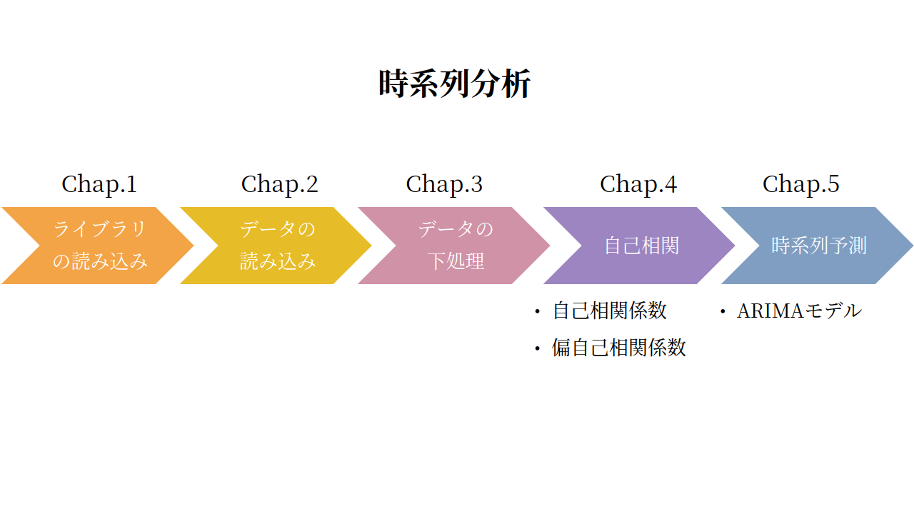
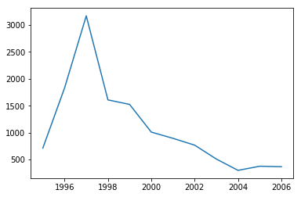
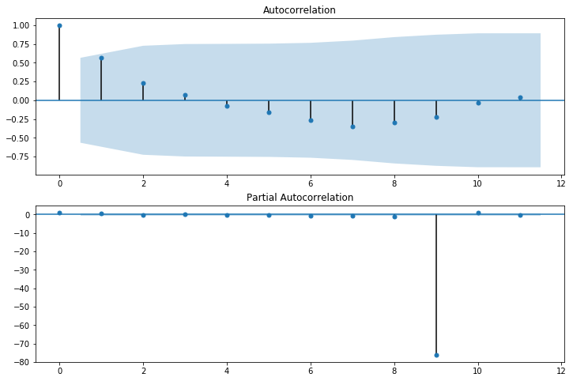
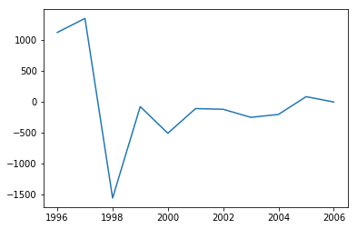

# Part 4 時系列分析

## Chap.0 全体の流れ
<p>Part4では時系列分析をする。時系列分析とは、時系列データの時間の経過とともに起こる変化を分析することである。<br>
    時系列的な傾向分析や将来予測などに利用される統計手法である。</p>
<p>ChemTHEATREでは、samplesに各標本の採集年・月・日（それぞれ、CollectionYear・CollectionMonth・CollectionDay）のデータが格納されている。<br>
今回は、これらの採集年月日の情報と計測データを組み合わせて、時系列データとみなして、時系列分析し、将来値の予測を行う。</p>



## Chap.1 ライブラリの読み込み


```python
%matplotlib inline
import datetime
import numpy as np
import pandas as pd
from scipy import stats
from matplotlib import pylab as plt
import seaborn as sns
import statsmodels.api as sm
from statsmodels.tsa.arima_model import ARIMA
```

<p>まず、必要なライブラリを読み込む。1行目は例によって、Jupyter Notebook内にmatplotlibで描画したグラフを表示するマジックコマンドである。<br>
  続いて、2行目以降が必要なライブラリである。datetimeライブラリはPythonに標準で実装されている、日付型<sup><a href=#sup1>1</a></sup>や時刻型<sup><a href=#sup1>1</a></sup>のデータを処理するライブラリである。他のライブラリはAnacondaにインストールされているもので、別途インストールする必要はない。
</p>
<table style="font-size: 0.8rem">
  <tr>
    <th>ライブラリ</th>
    <th>概要</th>
    <th>今回の使用目的</th>
    <th>公式URL</th>
  </tr>
  <tr>
    <td align="left">datetime</td>
    <td align="left">標準の日付型・時間型の処理ライブラリ</td>
    <td align="left">時系列データの日付処理に利用</td>
    <td align="left"><a href=https://docs.python.org/ja/3/library/datetime.html#module-datetime>https://docs.python.org/ja/3/library/datetime.html#module-datetime</a></td>
  </tr>
  <tr>
    <td align="left">NumPy</td>
    <td align="left">数値計算ライブラリ</td>
    <td align="left">統計処理上の数値計算に利用</td>
    <td align="left"><a href=https://www.numpy.org>https://www.numpy.org</a></td>
  </tr>
  <tr>
    <td align="left">pandas</td>
    <td align="left">データ分析ライブラリ</td>
    <td align="left">データ読み込みや整形に利用</td>
    <td align="left"><a href=https://pandas.pydata.org>https://pandas.pydata.org</a></td>
  </tr>
  <tr>
    <td align="left">Scipy</td>
    <td align="left">科学計算ライブラリ</td>
    <td align="left">統計的推定の計算に利用</td>
    <td align="left"><a href=https://www.scipy.org>https://www.scipy.org</a></td>
  </tr>
  <tr>
    <td align="left">Matplotlib</td>
    <td align="left">グラフ描画ライブラリ</td>
    <td align="left">データの可視化に利用</td>
    <td align="left"><a href=https://matplotlib.org>https://matplotlib.org</a></td>
  </tr>
  <tr>
    <td align="left">seaborn</td>
    <td align="left">統計データ可視化ライブラリ</td>
    <td align="left">データの可視化に利用</td>
    <td align="left"><a href=https://seaborn.pydata.org>https://seaborn.pydata.org</a></td>
  </tr>
  <tr>
    <td align="left">StatsModels</td>
    <td align="left">統計モデルの推定ライブラリ</td>
    <td align="left">回帰分析・時系列モデルの推定に利用</td>
    <td align="left"><a href=https://www.statsmodels.org>https://www.statsmodels.org</a></td>
  </tr>
</table>


## Chap.2 データの読み込み

<p>ライブラリの準備ができたら、次はデータの準備を行う。今回利用するデータはChemTHEATREのスナメリ（Neophocaena phocaenoides）である。Sample Searchからデータを検索し、measureddataとsamplesをダウンロードし、このノートブックファイルに読み込む。</p>
```python
data_file = "measureddata_20190826061813.tsv"    #変数に入力する文字列を、各自のmeasureddataのtsvファイル名に変更する
data = pd.read_csv(data_file, delimiter="\t")
data = data.drop(["ProjectID", "ScientificName", "RegisterDate", "UpdateDate"], axis=1)    #後でsamplesと結合する際に重複する列の削除
```


```python
sample_file = "samples_20190826061810.tsv"    #変数に入力する文字列を、各自のsamplesのtsvファイル名に変更する
sample = pd.read_csv(sample_file, delimiter="\t")
```


## Chap.3 データの下処理

<p>データの読み込みが終わったら、今度はデータの下処理を行う。まずは、各データと計測年の情報を紐付けるためにmeasureddataとsamplesの結合を行う。</p>
```python
df = pd.merge(data, sample, on="SampleID")    #measureddataとsamplesの結合
```

<p>次に、今回利用する時系列データのもととなるデータを抽出する。今回利用するのは、スナメリの1995年から2006年にかけてのΣBTs (有機スズ) のデータである。</p>

```python
df = df[(df["ChemicalName"] == "ΣBTs") & (df["Unit"] == "ng/g wet")]
df = df[(df["CollectionYear"] >= 1995) & (df["CollectionYear"] <= 2006)].reset_index()
```


```python
for i in range(len(df)):
    df.at[i, "CollectionYear"] = datetime.date(df.at[i, "CollectionYear"], 1, 1)
df[['CollectionYear', "MeasuredValue", "Unit"]]
```


<table border="1" class="dataframe" style="font-size: 0.8rem">
  <thead>
    <tr style="text-align: left;">
      <th></th>
      <th>CollectionYear</th>
      <th>MeasuredValue</th>
      <th>Unit</th>
    </tr>
  </thead>
  <tbody>
    <tr>
      <th>0</th>
      <td>1996-01-01</td>
      <td>434.903600</td>
      <td>ng/g wet</td>
    </tr>
    <tr>
      <th>1</th>
      <td>1999-01-01</td>
      <td>188.438500</td>
      <td>ng/g wet</td>
    </tr>
    <tr>
      <th>2</th>
      <td>1995-01-01</td>
      <td>227.792500</td>
      <td>ng/g wet</td>
    </tr>
    <tr>
      <th>3</th>
      <td>2000-01-01</td>
      <td>132.817800</td>
      <td>ng/g wet</td>
    </tr>
    <tr>
      <th>4</th>
      <td>1998-01-01</td>
      <td>36.695300</td>
      <td>ng/g wet</td>
    </tr>
    <tr>
      <th>...</th>
      <td>...</td>
      <td>...</td>
      <td>...</td>
    </tr>
    <tr>
      <th>80</th>
      <td>2001-01-01</td>
      <td>850.256364</td>
      <td>ng/g wet</td>
    </tr>
    <tr>
      <th>81</th>
      <td>1999-01-01</td>
      <td>2670.000000</td>
      <td>ng/g wet</td>
    </tr>
    <tr>
      <th>82</th>
      <td>2001-01-01</td>
      <td>2020.000000</td>
      <td>ng/g wet</td>
    </tr>
    <tr>
      <th>83</th>
      <td>1998-01-01</td>
      <td>2000.000000</td>
      <td>ng/g wet</td>
    </tr>
    <tr>
      <th>84</th>
      <td>2000-01-01</td>
      <td>2039.485282</td>
      <td>ng/g wet</td>
    </tr>
  </tbody>
</table>
<p>85 rows × 3 columns</p>


<p>最後に、時系列データとしてまとめる処理を行う。上の出力結果を見れば明らかだが、採集年月日が同日のデータがいくつかある。そこで、ここでは同日のデータについては平均値を取る。なお、この際、Pandasのグルーピング機能である、groupbyメソッドを利用すると便利である。</p>
```python
df_rev = df[['CollectionYear', "MeasuredValue", "Unit"]]
df_sec = df_rev.groupby('CollectionYear').agg(np.mean)    #CollectionDate列の値が同じものをグループ化し、Numpy.mean()関数を使い平均を求める
df_sec
```


<table border="1" class="dataframe" style="font-size: 0.8rem">
  <thead>
    <tr style="text-align: left;">
      <th></th>
      <th>MeasuredValue</th>
    </tr>
    <tr>
      <th>CollectionYear</th>
      <th></th>
    </tr>
  </thead>
  <tbody>
    <tr>
      <th>1995-01-01</th>
      <td>711.198125</td>
    </tr>
    <tr>
      <th>1996-01-01</th>
      <td>1828.250225</td>
    </tr>
    <tr>
      <th>1997-01-01</th>
      <td>3172.979867</td>
    </tr>
    <tr>
      <th>1998-01-01</th>
      <td>1608.143932</td>
    </tr>
    <tr>
      <th>1999-01-01</th>
      <td>1523.968437</td>
    </tr>
    <tr>
      <th>2000-01-01</th>
      <td>1008.685270</td>
    </tr>
    <tr>
      <th>2001-01-01</th>
      <td>892.614228</td>
    </tr>
    <tr>
      <th>2002-01-01</th>
      <td>765.341989</td>
    </tr>
    <tr>
      <th>2003-01-01</th>
      <td>507.301524</td>
    </tr>
    <tr>
      <th>2004-01-01</th>
      <td>296.438800</td>
    </tr>
    <tr>
      <th>2005-01-01</th>
      <td>373.346300</td>
    </tr>
    <tr>
      <th>2006-01-01</th>
      <td>364.000000</td>
    </tr>
  </tbody>
</table>


<p>それでは、時系列データとして処理したデータの概要を見るために、まず可視化する。<br>
Pythonでは時系列データの可視化は簡単である。時系列データをmatplotlibのpyplot.plot関数に与えるだけで折れ線グラフを生成する。</p>


```python
plt.figure()
plt.plot(df_sec)
plt.show()
```

    C:\Users\masah\Anaconda3\lib\site-packages\pandas\plotting\_converter.py:129: FutureWarning: Using an implicitly registered datetime converter for a matplotlib plotting method. The converter was registered by pandas on import. Future versions of pandas will require you to explicitly register matplotlib converters.
    
    To register the converters:
    	>>> from pandas.plotting import register_matplotlib_converters
    	>>> register_matplotlib_converters()
      warnings.warn(msg, FutureWarning)





## Chap.4 自己相関

<p>まず、自己相関について調べる。自己相関とは、データ自身の過去のデータとの相関のことである。つまり自己相関から、元のデータと時間をずらしたデータがどれぐらい似ているかがわかる。例えば、1日前のデータと大きい正の相関があれば、「一日前に多ければ、今日も多い」ということがわかる。なので、自己相関を調べることで、時間変化によるデータ増減の傾向を掴むことができるのである。</p>
<p>Pythonでは、statsmodelsのtsa.stattools.acf関数を利用することで、時差ごとの自己相関係数を調べることができる。</p>
```python
ts_acf = sm.tsa.stattools.acf(df_sec, nlags=11) #nlagsの説明はなくて良いのか？また11にした理由はなにか。
ts_acf
```

    C:\Users\masah\Anaconda3\lib\site-packages\statsmodels\tsa\stattools.py:541: FutureWarning: fft=True will become the default in a future version of statsmodels. To suppress this warning, explicitly set fft=False.
      warnings.warn(msg, FutureWarning)


    array([ 1.        ,  0.56902314,  0.23084955,  0.07465438, -0.08049572,
           -0.16174957, -0.26708279, -0.34610377, -0.29218151, -0.2276292 ,
           -0.03492394,  0.03563944])


<p>時系列データの自己相関を調べるにあたって注意すべきことがある。それは、時点 $t$と時点 $t-1$で自己相関が見られるときに、時点 $t$と時点 $t-2$の自己相関に時点$t-1$の情報が含まれている可能性があるということである。例えば、ある時系列データが、ある観測値$y_n$がその前日の観測値$y_n-1$の$r$倍となる場合、以下の式のようになる。<br>
$$y_n = r \times y_n-1 = r^2 \times y_n-1$$<br>
このとき、時点 $t$と時点 $t-1$の自己相関が高ければ、それに引っ張られて、時点 $t$ と時点 $t-2$ の自己相関も高くなる。つまり、自己相関が高いだけでは時系列としての関係があるとは言い切れない。このようなときに、時点 $t-1$の情報を取り除くことで、時点 $t$ と時点 $t-2$ の真の自己相関を求めたのが偏自己相関係数である。</p>
<p>こちらは、statsmodelsのtsa.stattools.pacf関数を利用することで求めることができる。</p>

```python
ts_pacf = sm.tsa.stattools.pacf(df_sec, nlags=11, method='ols') #nlagsの説明はなくて良いのか？また11にした理由はなにか。
ts_pacf
```


    array([ 1.        ,  0.61148151, -0.1543712 ,  0.0024422 ,  0.01796268,
            0.06231964,  0.06054158, -0.02415856,  0.051324  ,  0.06175244,
            0.02238197,  0.01192467])


<p>続いて自己相関と時差の関係をグラフで可視化してみる。このようなグラフのことを「コレログラム」という。</p>
<p>Pythonではstatsmodelsにgraphicsというモジュールがあり、その中のgraphics.tsa.plot_acfやgraphics.tsa.plot_pacfを利用することでそれぞれ自己相関係数、偏自己相関係数のコレログラムを描くことができる。</p>
```python
fig = plt.figure(figsize=(12,8))
ax1 = fig.add_subplot(211)
fig = sm.graphics.tsa.plot_acf(df_sec, lags=11, ax=ax1)
ax2 = fig.add_subplot(212)
fig = sm.graphics.tsa.plot_pacf(df_sec, lags=11, ax=ax2)
```

    C:\Users\masah\Anaconda3\lib\site-packages\statsmodels\regression\linear_model.py:1358: RuntimeWarning: invalid value encountered in sqrt
      return rho, np.sqrt(sigmasq)





## Chap.5 ARIMAモデルによる予測

<p>最後にモデル化を行う。時系列分析では、いくつか代表的なモデルがあるが、今回は一般的なARIMAモデルを推定してみる。<br>
ARIMAモデルとは、データの差分をとったものに、前のデータから回帰するARモデル（自己回帰モデル）と、前後の値の平均を取るMAモデル（移動平均モデル）を組み合わせたARMAモデルのことである。</p>
<p>したがってまず、データの差分を取ることから始める。Pythonではpandasにdiffメソッドがあるので、これを利用する。</p>

```python
diff = df_sec.diff().dropna()
diff, plt.plot(diff)
```


    (                MeasuredValue
     CollectionYear               
     1996-01-01        1117.052100
     1997-01-01        1344.729642
     1998-01-01       -1564.835935
     1999-01-01         -84.175495
     2000-01-01        -515.283167
     2001-01-01        -116.071042
     2002-01-01        -127.272239
     2003-01-01        -258.040465
     2004-01-01        -210.862724
     2005-01-01          76.907500
     2006-01-01          -9.346300, [<matplotlib.lines.Line2D at 0x1bbf8ae9d68>])




<p>続いてARIMAモデルの推定をするために、ARMAの次数<sup><a href=#sup2>2</a></sup>を決定する。Pythonの場合、ARIMAの次数を自動で決定する関数はない<sup><a href=#sup3>3</a></sup>ので、ARMAの次数は任意に決める必要がある。ここでは、Pythonで自動化されているARMAの次数決定関数（statsmodelのtsa.arma_order_select_ic関数）を用いてARとMAの次数を決定する。</p>
```python
resDiff = sm.tsa.arma_order_select_ic(diff, ic='aic', trend='nc') #引数の説明が必要では
resDiff
```

    C:\Users\masah\Anaconda3\lib\site-packages\statsmodels\base\model.py:492: HessianInversionWarning: Inverting hessian failed, no bse or cov_params available
      'available', HessianInversionWarning)


    {'aic':             0           1           2
     0         NaN  180.329160  181.573386
     1  180.351416  181.456354  183.341637
     2  181.715732  184.163202  185.130981
     3  183.641615  185.339004  187.321175
     4  185.579763  187.570400  189.321108, 'aic_min_order': (0, 1)}


<p>ARIMAの時系列推定については、PythonではstatsmodelのARIMA関数ですることができる。この関数では、orderパラメータに各次数（AR, I（差分を取る回数）, MA）をタプル形式で入力する。</p>
```python
arima = ARIMA(df_sec, order=(0, 0, 1)).fit(dist=False)
resid = arima.resid
```

    C:\Users\masah\Anaconda3\lib\site-packages\statsmodels\tsa\base\tsa_model.py:165: ValueWarning: No frequency information was provided, so inferred frequency AS-JAN will be used.
      % freq, ValueWarning)


<p>ARIMAでの時系列推定ができたので、このモデルが妥当かを、残差の自己相関を見て判断する。自己相関の可視化は先述のとおりである。</p>
```python
fig = plt.figure(figsize=(12,8))
ax1 = fig.add_subplot(211)
fig = sm.graphics.tsa.plot_acf(resid.values.squeeze(), lags=10, ax=ax1)
ax2 = fig.add_subplot(212)
fig = sm.graphics.tsa.plot_pacf(resid, lags=10, ax=ax2)
```


<p>最後に時系列分析した結果を可視化してみる。時系列分析での予測は、statsmodelのpredictメソッドを使えば、そのモデルの指定した範囲での予測ができる。</p>
```python
pred_arima = arima.predict('2001-01-01', '2006-01-01')    #予測

plt.plot(df_sec)
plt.plot(pred_arima, "r")
```


    [<matplotlib.lines.Line2D at 0x1bbf96fecc0>]


## 脚注

<p><sup id=sup1>1</sup>日付や時刻のデータを格納するデータの型のこと。これらのデータは、一般の文字列と異なり連続性があり、一般の数値と異なり十進法ではない。したがって、日付型や時刻型を処理する独自のライブラリが必要となる。</p>
<p>
<p><sup id=sup2>2</sup>次数とは、時系列推定モデルにおいて、どれぐらい過去のデータを参考にするかということである。ARIMAモデルの場合、AR（自己回帰モデル）の次数、MA（移動平均モデル）の次数、I（差分を取る回数）の３つの次数が存在する。</p>
<p><sup id=sup3>3</sup>PythonのモジュールではARIMAの次数３つすべてを自動計算できないので、繰り返し処理をして総当りで試行する方法がある。</p>

