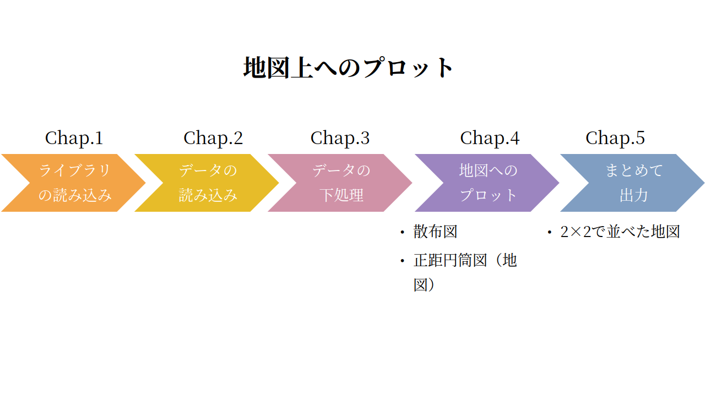
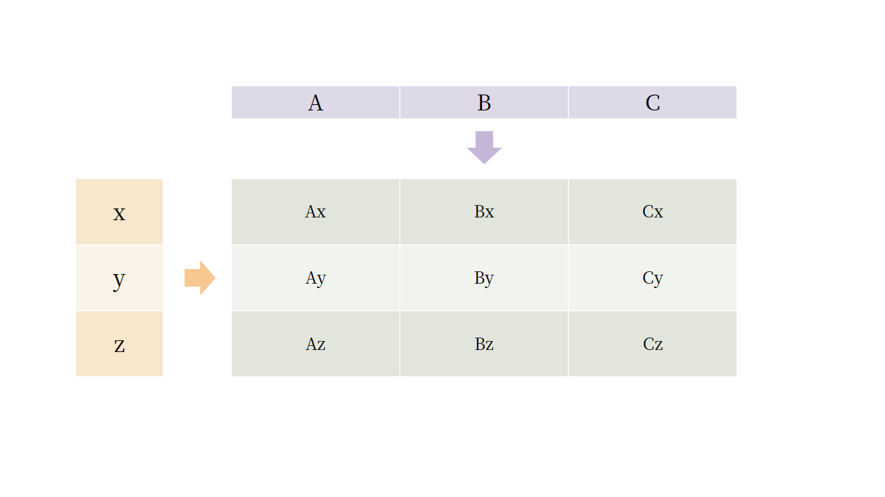

# Part 5 ChemTHEATREデータの地図上へのプロット（前編）

## Chap.0 全体の流れ
<p>Part 5では、ChemTHEATREのデータを利用して、計測された化学物質の濃度を地図上にプロットする。いうなれば簡易的なGISである。<br>
  前編ではデータ処理～地図上へのプロットを、後編では出力した画像データをつなぎ合わせてアニメーションを作成することを目指す。</p>




## Chap.1 ライブラリの読み込み


```python
%matplotlib inline
import os
import numpy as np
import pandas as pd
import itertools
import matplotlib.pyplot as plt
from cartopy import crs as ccrs

#cartopyのインストールについては説明不要？MacのAnacondaでは読み込まれなかった。
```

<p>今回も処理に必要になってくるライブラリーをインポートするところから始める。<br>
1行目は例によって、matplotlibの出力結果を表示するコマンドである。<br>
Part 5では、以下のライブラリを利用することになる。（2行目以降参照）<br>
なお、いずれもAnaconda3(Windows 64bit版)にはすでにインストールされている。<br>
今回は、matplotlibのグラフ上に地図を表示するためにcartopyを利用する。
</p>
<table style="text-align: left; font-size: 0.8rem">
  <tr align="left">
    <th>ライブラリ</th>
    <th>概要</th>
    <th>今回の使用目的</th>
    <th>公式URL</th>
  </tr>
   <tr align="left">
    <td>os</td>
    <td>標準ライブラリ</td>
    <td>ディレクトリの操作</td>
    <td><a href=https://docs.python.org/ja/3/library/os.html>https://docs.python.org/ja/3/library/os.html</a></td>
  </tr>
  <tr align="left">
    <td>NumPy</td>
    <td>数値計算ライブラリ</td>
    <td>統計処理上の数値計算に利用</td>
    <td><a href=https://www.numpy.org>https://www.numpy.org</a></td>
  </tr>
  <tr align="left">
    <td>itertools</td>
    <td>イテレータ<sup><a href=#sup1>1</a></sup>を生成する<br>標準ライブラリ</td>
    <td>ループ処理を効率化するのに利用</td>
    <td><a href=https://docs.python.org/ja/3/library/itertools.html>https://docs.python.org/ja/3/library/itertools.html</a></td>
  </tr>
  <tr align="left">
    <td>pandas</td>
    <td>データ分析ライブラリ</td>
    <td>データ処理や整形に利用</td>
    <td><a href=https://pandas.pydata.org>https://pandas.pydata.org</a></td>
  </tr>
  <tr align="left">
    <td>Matplotlib</td>
    <td>グラフ描画ライブラリ</td>
    <td>データの可視化に利用</td>
    <td><a href=https://matplotlib.org>https://matplotlib.org</a></td>
  </tr>
  <tr align="left">
    <td>cartopy</td>
    <td>地図描画ライブラリ</td>
    <td>地図データの可視化に利用</td>
    <td><a href=https://scitools.org.uk/cartopy/docs/latest>https://scitools.org.uk/cartopy/docs/latest</a></td>
  </tr>
</table>

## Chap.2 データの読み込み
<p>ライブラリの準備ができたので、次にデータの読み込みを行う。今回使用するのは、ChemTHEATREのSample Searchから海棲哺乳類（Sample Typeを「Biotic - Mammals - Marine mammals」）のデータである。ダウンロードできたら、いつもの要領でノートブックから読み込む。</p>
```python
data_file = "measureddata_20191002074038.tsv"    #変数に入力する文字列を、各自のmeasureddataのtsvファイル名に変更する
data = pd.read_csv(data_file, delimiter="\t")
data = data.drop(["ProjectID", "ScientificName", "RegisterDate", "UpdateDate"], axis=1)    #後でsamplesと結合する際に重複する列の削除
data
```


<table border="1" class="dataframe" style="font-size: 0.8rem">
  <thead>
    <tr style="text-align: left;">
      <th></th>
      <th>MeasuredID</th>
      <th>SampleID</th>
      <th>ChemicalID</th>
      <th>ChemicalName</th>
      <th>ExperimentID</th>
      <th>MeasuredValue</th>
      <th>AlternativeData</th>
      <th>Unit</th>
      <th>Remarks</th>
    </tr>
  </thead>
  <tbody>
    <tr>
      <th>0</th>
      <td>1026</td>
      <td>SAA000173</td>
      <td>CH0000034</td>
      <td>PCB4+PCB10</td>
      <td>EXA000001</td>
      <td>0.010</td>
      <td>&lt;1.00E-2</td>
      <td>ng/g lipid</td>
      <td>NaN</td>
    </tr>
    <tr>
      <th>1</th>
      <td>1027</td>
      <td>SAA000173</td>
      <td>CH0000035</td>
      <td>PCB8</td>
      <td>EXA000001</td>
      <td>0.010</td>
      <td>&lt;1.00E-2</td>
      <td>ng/g lipid</td>
      <td>NaN</td>
    </tr>
    <tr>
      <th>2</th>
      <td>1028</td>
      <td>SAA000173</td>
      <td>CH0000037</td>
      <td>PCB19</td>
      <td>EXA000001</td>
      <td>0.010</td>
      <td>&lt;1.00E-2</td>
      <td>ng/g lipid</td>
      <td>NaN</td>
    </tr>
    <tr>
      <th>3</th>
      <td>1029</td>
      <td>SAA000173</td>
      <td>CH0000038</td>
      <td>PCB22</td>
      <td>EXA000001</td>
      <td>0.010</td>
      <td>&lt;1.00E-2</td>
      <td>ng/g lipid</td>
      <td>NaN</td>
    </tr>
    <tr>
      <th>4</th>
      <td>1030</td>
      <td>SAA000173</td>
      <td>CH0000039</td>
      <td>PCB28</td>
      <td>EXA000001</td>
      <td>32.000</td>
      <td>NaN</td>
      <td>ng/g lipid</td>
      <td>NaN</td>
    </tr>
    <tr>
      <th>...</th>
      <td>...</td>
      <td>...</td>
      <td>...</td>
      <td>...</td>
      <td>...</td>
      <td>...</td>
      <td>...</td>
      <td>...</td>
      <td>...</td>
    </tr>
    <tr>
      <th>7098</th>
      <td>27705</td>
      <td>SAA002002</td>
      <td>CH0000094</td>
      <td>PCB208</td>
      <td>EXA000001</td>
      <td>77.249</td>
      <td>NaN</td>
      <td>ng/g lipid</td>
      <td>NaN</td>
    </tr>
    <tr>
      <th>7099</th>
      <td>27706</td>
      <td>SAA002002</td>
      <td>CH0000088</td>
      <td>PCB194</td>
      <td>EXA000001</td>
      <td>512.160</td>
      <td>NaN</td>
      <td>ng/g lipid</td>
      <td>NaN</td>
    </tr>
    <tr>
      <th>7100</th>
      <td>27707</td>
      <td>SAA002002</td>
      <td>CH0000092</td>
      <td>PCB205</td>
      <td>EXA000001</td>
      <td>3.000</td>
      <td>&lt;3.00E+0</td>
      <td>ng/g lipid</td>
      <td>NaN</td>
    </tr>
    <tr>
      <th>7101</th>
      <td>27708</td>
      <td>SAA002002</td>
      <td>CH0000093</td>
      <td>PCB206</td>
      <td>EXA000001</td>
      <td>81.947</td>
      <td>NaN</td>
      <td>ng/g lipid</td>
      <td>NaN</td>
    </tr>
    <tr>
      <th>7102</th>
      <td>27709</td>
      <td>SAA002002</td>
      <td>CH0000095</td>
      <td>PCB209</td>
      <td>EXA000001</td>
      <td>127.064</td>
      <td>NaN</td>
      <td>ng/g lipid</td>
      <td>NaN</td>
    </tr>
  </tbody>
</table>
<p>7103 rows × 9 columns</p>


```python
sample_file = "samples_20191002074035.tsv"    #変数に入力する文字列を、各自のsamplesのtsvファイル名に変更する
sample = pd.read_csv(sample_file, delimiter="\t")
sample
```


<table border="1" class="dataframe" style="font-size: 0.8rem">
  <thead>
    <tr style="text-align: left;">
      <th></th>
      <th>ProjectID</th>
      <th>SampleID</th>
      <th>SampleType</th>
      <th>TaxonomyID</th>
      <th>UniqCodeType</th>
      <th>UniqCode</th>
      <th>SampleName</th>
      <th>ScientificName</th>
      <th>...</th>
    </tr>
  </thead>
  <tbody>
    <tr>
      <th>0</th>
      <td>PRA000003</td>
      <td>SAA000173</td>
      <td>ST004</td>
      <td>34892</td>
      <td>es-BANK</td>
      <td>EW00884</td>
      <td>M32582</td>
      <td>Neophocaena phocaenoides</td>
      <td>...</td>
    </tr>
    <tr>
      <th>1</th>
      <td>PRA000003</td>
      <td>SAA000174</td>
      <td>ST004</td>
      <td>34892</td>
      <td>es-BANK</td>
      <td>EW00888</td>
      <td>M32588</td>
      <td>Neophocaena phocaenoides</td>
      <td>...</td>
    </tr>
    <tr>
      <th>2</th>
      <td>PRA000003</td>
      <td>SAA000175</td>
      <td>ST004</td>
      <td>34892</td>
      <td>es-BANK</td>
      <td>EW00932</td>
      <td>M32580</td>
      <td>Neophocaena phocaenoides</td>
      <td>...</td>
    </tr>
    <tr>
      <th>3</th>
      <td>PRA000003</td>
      <td>SAA000176</td>
      <td>ST004</td>
      <td>34892</td>
      <td>es-BANK</td>
      <td>EW00929</td>
      <td>M33556</td>
      <td>Neophocaena phocaenoides</td>
      <td>...</td>
    </tr>
    <tr>
      <th>4</th>
      <td>PRA000003</td>
      <td>SAA000177</td>
      <td>ST004</td>
      <td>34892</td>
      <td>es-BANK</td>
      <td>EW00934</td>
      <td>M32548</td>
      <td>Neophocaena phocaenoides</td>
      <td>...</td>
    </tr>
    <tr>
      <th>...</th>
      <td>...</td>
      <td>...</td>
      <td>...</td>
      <td>...</td>
      <td>...</td>
      <td>...</td>
      <td>...</td>
      <td>...</td>
      <td>...</td>
    </tr>
    <tr>
      <th>197</th>
      <td>PRA000036</td>
      <td>SAA002159</td>
      <td>ST004</td>
      <td>103596</td>
      <td>es-BANK</td>
      <td>EW04779</td>
      <td>060301-1</td>
      <td>Peponocephala electra</td>
      <td>...</td>
    </tr>
    <tr>
      <th>198</th>
      <td>PRA000036</td>
      <td>SAA002160</td>
      <td>ST004</td>
      <td>103596</td>
      <td>es-BANK</td>
      <td>EW00115</td>
      <td>M32625</td>
      <td>Peponocephala electra</td>
      <td>...</td>
    </tr>
    <tr>
      <th>199</th>
      <td>PRA000036</td>
      <td>SAA002161</td>
      <td>ST004</td>
      <td>103596</td>
      <td>es-BANK</td>
      <td>EW00122</td>
      <td>M32633</td>
      <td>Peponocephala electra</td>
      <td>...</td>
    </tr>
    <tr>
      <th>200</th>
      <td>PRA000036</td>
      <td>SAA002162</td>
      <td>ST004</td>
      <td>103596</td>
      <td>es-BANK</td>
      <td>EW00116</td>
      <td>M32626</td>
      <td>Peponocephala electra</td>
      <td>...</td>
    </tr>
    <tr>
      <th>201</th>
      <td>PRA000036</td>
      <td>SAA002163</td>
      <td>ST004</td>
      <td>103596</td>
      <td>es-BANK</td>
      <td>EW00117</td>
      <td>M32627</td>
      <td>Peponocephala electra</td>
      <td>...</td>
    </tr>
  </tbody>
</table>
<p>202 rows × 66 columns</p>


## Chap.3 データの下処理
<p>Chap.2で読み込んだDataFrameを地図にプロットできるようにした準備する。まず、measureddataとsamplesを結合し、N/Aの列を削除する。</p>
```python
df = pd.merge(data, sample, on="SampleID")

df = df.dropna(how='all', axis=1)
df
```


<table border="1" class="dataframe" style="font-size: 0.8rem">
  <thead>
    <tr style="text-align: left;">
      <th></th>
      <th>MeasuredID</th>
      <th>SampleID</th>
      <th>ChemicalID</th>
      <th>ChemicalName</th>
      <th>ExperimentID</th>
      <th>MeasuredValue</th>
      <th>AlternativeData</th>
      <th>Unit</th>
      <th>...</th>
    </tr>
  </thead>
  <tbody>
    <tr>
      <th>0</th>
      <td>1026</td>
      <td>SAA000173</td>
      <td>CH0000034</td>
      <td>PCB4+PCB10</td>
      <td>EXA000001</td>
      <td>0.010</td>
      <td>&lt;1.00E-2</td>
      <td>ng/g lipid</td>
      <td>...</td>
    </tr>
    <tr>
      <th>1</th>
      <td>1027</td>
      <td>SAA000173</td>
      <td>CH0000035</td>
      <td>PCB8</td>
      <td>EXA000001</td>
      <td>0.010</td>
      <td>&lt;1.00E-2</td>
      <td>ng/g lipid</td>
      <td>...</td>
    </tr>
    <tr>
      <th>2</th>
      <td>1028</td>
      <td>SAA000173</td>
      <td>CH0000037</td>
      <td>PCB19</td>
      <td>EXA000001</td>
      <td>0.010</td>
      <td>&lt;1.00E-2</td>
      <td>ng/g lipid</td>
      <td>...</td>
    </tr>
    <tr>
      <th>3</th>
      <td>1029</td>
      <td>SAA000173</td>
      <td>CH0000038</td>
      <td>PCB22</td>
      <td>EXA000001</td>
      <td>0.010</td>
      <td>&lt;1.00E-2</td>
      <td>ng/g lipid</td>
      <td>...</td>
    </tr>
    <tr>
      <th>4</th>
      <td>1030</td>
      <td>SAA000173</td>
      <td>CH0000039</td>
      <td>PCB28</td>
      <td>EXA000001</td>
      <td>32.000</td>
      <td>NaN</td>
      <td>ng/g lipid</td>
      <td>...</td>
    </tr>
    <tr>
      <th>...</th>
      <td>...</td>
      <td>...</td>
      <td>...</td>
      <td>...</td>
      <td>...</td>
      <td>...</td>
      <td>...</td>
      <td>...</td>
      <td>...</td>
    </tr>
    <tr>
      <th>7098</th>
      <td>27705</td>
      <td>SAA002002</td>
      <td>CH0000094</td>
      <td>PCB208</td>
      <td>EXA000001</td>
      <td>77.249</td>
      <td>NaN</td>
      <td>ng/g lipid</td>
      <td>...</td>
    </tr>
    <tr>
      <th>7099</th>
      <td>27706</td>
      <td>SAA002002</td>
      <td>CH0000088</td>
      <td>PCB194</td>
      <td>EXA000001</td>
      <td>512.160</td>
      <td>NaN</td>
      <td>ng/g lipid</td>
      <td>...</td>
    </tr>
    <tr>
      <th>7100</th>
      <td>27707</td>
      <td>SAA002002</td>
      <td>CH0000092</td>
      <td>PCB205</td>
      <td>EXA000001</td>
      <td>3.000</td>
      <td>&lt;3.00E+0</td>
      <td>ng/g lipid</td>
      <td>...</td>
    </tr>
    <tr>
      <th>7101</th>
      <td>27708</td>
      <td>SAA002002</td>
      <td>CH0000093</td>
      <td>PCB206</td>
      <td>EXA000001</td>
      <td>81.947</td>
      <td>NaN</td>
      <td>ng/g lipid</td>
      <td>...</td>
    </tr>
    <tr>
      <th>7102</th>
      <td>27709</td>
      <td>SAA002002</td>
      <td>CH0000095</td>
      <td>PCB209</td>
      <td>EXA000001</td>
      <td>127.064</td>
      <td>NaN</td>
      <td>ng/g lipid</td>
      <td>...</td>
    </tr>
  </tbody>
</table>
<p>7103 rows × 39 columns</p>


<p>次に、必要なデータの抽出を行う。今回取り扱うのは単位が[ng/g lipid]の4種類の化学物質（ΣPCBs, ΣDDTs, ΣCHLs, ΣHCHs）についてのデータである。</p>
```python
data_lipid = df[df["Unit"] == "ng/g lipid"]
data_lipid = data_lipid[(data_lipid["ChemicalName"] == "ΣPCBs") | (data_lipid["ChemicalName"] == "ΣDDTs") |
                        (data_lipid["ChemicalName"] == "ΣCHLs") | (data_lipid["ChemicalName"] == "ΣHCHs")]
```

<p>これで必要なデータの抽出は終了した。確認も兼ねて、このデータセットに含まれる生物種と化学物質名の一覧を取得する。</p>
```python
lipid_species = data_lipid["ScientificName"].unique()
lipid_chemicals = data_lipid["ChemicalName"].unique()

lipid_species, lipid_chemicals
```


    (array(['Peponocephala electra', 'Neophocaena phocaenoides',
            'Sousa chinensis', 'Stenella coeruleoalba'], dtype=object),
     array(['ΣPCBs', 'ΣDDTs', 'ΣCHLs', 'ΣHCHs'], dtype=object))


<p>またここで、後編でも同じデータを利用できるように、DataFrame・data_lipidをCSV形式で出力しておく。CSVの出力はPandasのto_csvメソッドを利用する。</p>
```python
data_lipid.to_csv("data.csv")
```


## Chap.4 地図へのプロット

### Sec.4-1 ベースとなる図
<p>続いて、今回のメインである、地図上へのプロットを行う。だが、最初にどのように地図を作成するかを丁寧に確認しておく。<br>
今回のグラフは、地図上に出力することになるので、まず地図の出力を行う。Pythonではcartopyを利用すると、matplotlib上に地図を出力する事ができる。</p>


```python
ax = plt.axes(projection=ccrs.PlateCarree())
ax.coastlines()
plt.show()
```


<p>次に、地図の上に重ねるグラグの確認をする。今回は緯度・経度の2次元空間内での地点を計測地点としてプロットするので、散布図としてデータを描く。<br>
描画する前に、data_lipidに含まれる生物種ごとにデータを選り分ける。</p>


```python
df_0 = data_lipid[(data_lipid["ChemicalName"] == "ΣPCBs") & (data_lipid["ScientificName"] == lipid_species[0])]    #カズハゴンドウのΣPCBs
df_1 = data_lipid[(data_lipid["ChemicalName"] == "ΣPCBs") & (data_lipid["ScientificName"] == lipid_species[1])]    #スナメリのΣPCBs
df_2 = data_lipid[(data_lipid["ChemicalName"] == "ΣPCBs") & (data_lipid["ScientificName"] == lipid_species[2])]    #シナウスイロイルカのΣPCBs
df_3 = data_lipid[(data_lipid["ChemicalName"] == "ΣPCBs") & (data_lipid["ScientificName"] == lipid_species[3])]    #スジイルカのΣPCBs
```

<p>データがより分けられたら、散布図に起こしてみる。matplotlibのグラフ描画は、上に重ねがけすることができるので、順々に書き加えていくイメージで良い。</p>
```python
fig = plt.figure()
ax = plt.axes()

#CollectionLongitudeFrom, CollectionLatitudeFromから緯度経度情報を抽出
ax.scatter(x = np.array(df_0["CollectionLongitudeFrom"]), y = np.array(df_0["CollectionLatitudeFrom"]), c = "red", alpha=0.5)
ax.scatter(x = np.array(df_1["CollectionLongitudeFrom"]), y = np.array(df_1["CollectionLatitudeFrom"]), c = "blue", alpha=0.5)
ax.scatter(x = np.array(df_2["CollectionLongitudeFrom"]), y = np.array(df_2["CollectionLatitudeFrom"]), c = "yellow", alpha=0.5)
ax.scatter(x = np.array(df_3["CollectionLongitudeFrom"]), y = np.array(df_3["CollectionLatitudeFrom"]), c = "green", alpha=0.5)
plt.show()
```


### Sec.4-2 散布図 + 正距円筒図法
<p>ベースとなる図が描画できたので、今度はそれらを重ね合わせて描画してみる。</p>
<figure id="process">

</figure>


```python
fig = plt.figure()
ax = plt.axes(projection=ccrs.PlateCarree())
ax.coastlines()
ax.scatter(x = np.array(df_0["CollectionLongitudeFrom"]), y = np.array(df_0["CollectionLatitudeFrom"]), c = "red", alpha=0.5)
ax.scatter(x = np.array(df_1["CollectionLongitudeFrom"]), y = np.array(df_1["CollectionLatitudeFrom"]), c = "blue", alpha=0.5)
ax.scatter(x = np.array(df_2["CollectionLongitudeFrom"]), y = np.array(df_2["CollectionLatitudeFrom"]), c = "yellow", alpha=0.5)
ax.scatter(x = np.array(df_3["CollectionLongitudeFrom"]), y = np.array(df_3["CollectionLatitudeFrom"]), c = "green", alpha=0.5)
plt.show()
```


### Sec.4-3 Sec.4-2の改良
<p>Sec.4-2で一応出力することができた。しかし、今の状態では地図の範囲が自動で設定されている。これは、データの存在する範囲が全て含まれるように自動処理されているだけなので、取り扱うデータによってその範囲が変わってしまう。ここでは、適当な範囲で地図を固定化する。</p>
<p>matplotlibのset_xlim・set_ylimメソッドを使うことで、それぞれ描画するグラフのX軸方向・Y軸方向の範囲を決めることができる。</p>
<figure id="process">

</figure>


```python
fig = plt.figure()
ax = plt.axes(projection=ccrs.PlateCarree())
ax.coastlines()
ax.scatter(x = np.array(df_0["CollectionLongitudeFrom"]), y = np.array(df_0["CollectionLatitudeFrom"]), c = "red", alpha=0.5)
ax.scatter(x = np.array(df_1["CollectionLongitudeFrom"]), y = np.array(df_1["CollectionLatitudeFrom"]), c = "blue", alpha=0.5)
ax.scatter(x = np.array(df_2["CollectionLongitudeFrom"]), y = np.array(df_2["CollectionLatitudeFrom"]), c = "yellow", alpha=0.5)
ax.scatter(x = np.array(df_3["CollectionLongitudeFrom"]), y = np.array(df_3["CollectionLatitudeFrom"]), c = "green", alpha=0.5)
ax.set_xlim(90,180)    #描画するX軸（経度）方向の範囲
ax.set_ylim(15, 60)    #描画するY軸（緯度）方向の範囲
ax.set_title("ΣPCBs")
plt.show()
```


## Chap.5 １枚にまとめて出力する

<p>Chap.3でわかったとおり、このDataFrameには４種類の化学物質のデータが含まれているので、これらを４つ並べて１枚にまとめた形にして出力してみる。</p>
<p>まず、Chap.4でもやったように、化学物質ごとにデータの選り分けを行うのだが、全部で16通り（生物・化学物質が４種ずつ）の組み合わせがあるので、ここではリストにまとめて、描画する際に順次読み込む形を取る。この際、それぞれの組み合わせ（例えばスナメリのΣPCBs）を生成する必要があるので、Pythonのイテレータ<sup><a href=#sup1>1</a></sup>という機能を利用して、直積<sup><a href=#sup2>2</a></sup>を求めることにする。つまり、化学物質のリスト（lipid_chemicals）と生物種名のリスト（lipid_species）の直積を求めて、16通りの組み合わせパターンすべてを導出する。</p>
```python
df_list = []
for k1, k2 in itertools.product(lipid_chemicals, lipid_species):
    df_list.append(data_lipid[(data_lipid["ChemicalName"] == k1) & (data_lipid["ScientificName"] == k2)])    #各組み合わせのデータを抽出
```

<figure id="process">

</figure>


```python
ax = [0]*4
fig = plt.figure(figsize=(16, 9))
for i in range(4): 
    ax[i] = fig.add_subplot(2, 2, i+1, projection=ccrs.PlateCarree())    #グラフを描く領域を追加
    ax[i].coastlines()
    ax[i].scatter(x = np.array(df_list[4*i+0]["CollectionLongitudeFrom"]), y = np.array(df_list[4*i+0]["CollectionLatitudeFrom"]),
                  c = "red", alpha=0.5)    #カズハゴンドウ
    ax[i].scatter(x = np.array(df_list[4*i+1]["CollectionLongitudeFrom"]), y = np.array(df_list[4*i+1]["CollectionLatitudeFrom"]), 
                  c = "blue", alpha=0.5)    #スナメリ
    ax[i].scatter(x = np.array(df_list[4*i+2]["CollectionLongitudeFrom"]), y = np.array(df_list[4*i+2]["CollectionLatitudeFrom"]), 
                  c = "yellow", alpha=0.5)    #シナウスイロイルカ
    ax[i].scatter(x = np.array(df_list[4*i+3]["CollectionLongitudeFrom"]), y = np.array(df_list[4*i+3]["CollectionLatitudeFrom"]), 
                  c = "green", alpha=0.5)    #スジイルカ
    ax[i].set_xlim(90,180)
    ax[i].set_ylim(15, 60)
    ax[i].set_title(lipid_chemicals[i])
plt.show()
```


<p>これでは計測地点が反映されるだけなので、測定値も地図上にプロットしてみる。各散布点の半径に反映してみる。散布図を描くscatterメソッドのsパラメータにMeasuredValue列のデータを代入するだけで良い。</p>
```python
fig = plt.figure(figsize=(16, 9))
for i in range(4): 
    ax[i] = fig.add_subplot(2, 2, i+1, projection=ccrs.PlateCarree())
    ax[i].coastlines()
    ax[i].scatter(x = np.array(df_list[4*i+0]["CollectionLongitudeFrom"]), y = np.array(df_list[4*i+0]["CollectionLatitudeFrom"]), s=np.array(df_list[4*i+0]["MeasuredValue"]), c = "red", alpha=0.5)
    ax[i].scatter(x = np.array(df_list[4*i+1]["CollectionLongitudeFrom"]), y = np.array(df_list[4*i+1]["CollectionLatitudeFrom"]), s=np.array(df_list[4*i+1]["MeasuredValue"]), c = "blue", alpha=0.5)
    ax[i].scatter(x = np.array(df_list[4*i+2]["CollectionLongitudeFrom"]), y = np.array(df_list[4*i+2]["CollectionLatitudeFrom"]), s=np.array(df_list[4*i+2]["MeasuredValue"]), c = "yellow", alpha=0.5)
    ax[i].scatter(x = np.array(df_list[4*i+3]["CollectionLongitudeFrom"]), y = np.array(df_list[4*i+3]["CollectionLatitudeFrom"]), s=np.array(df_list[4*i+3]["MeasuredValue"]), c = "green", alpha=0.5)
    ax[i].set_xlim(90,180)
    ax[i].set_ylim(15, 60)
    plt.title(lipid_chemicals[i])
plt.show()
```


<p></p>
<p>MeasuredValueの値をそのまま散布点の半径に代入すると、特にΣDDTsのグラフの円が大きくなって、全てが重なってしまうので半径を小さくするように調整する。ここでは、一律10分の1の大きさにする。</p>
```python
fig = plt.figure(figsize=(16, 9))
rate = [10,10,10,10]    #縮尺を示す変数
for i in range(4): 
    ax[i] = fig.add_subplot(2, 2, i+1, projection=ccrs.PlateCarree())
    ax[i].coastlines()
    ax[i].scatter(x = np.array(df_list[4*i+0]["CollectionLongitudeFrom"]), y = np.array(df_list[4*i+0]["CollectionLatitudeFrom"]), s=np.array(df_list[4*i+0]["MeasuredValue"])/rate[i], c = "red", alpha=0.3)
    ax[i].scatter(x = np.array(df_list[4*i+1]["CollectionLongitudeFrom"]), y = np.array(df_list[4*i+1]["CollectionLatitudeFrom"]), s=np.array(df_list[4*i+1]["MeasuredValue"])/rate[i], c = "blue", alpha=0.3)
    ax[i].scatter(x = np.array(df_list[4*i+2]["CollectionLongitudeFrom"]), y = np.array(df_list[4*i+2]["CollectionLatitudeFrom"]), s=np.array(df_list[4*i+2]["MeasuredValue"])/rate[i], c = "yellow", alpha=0.3)
    ax[i].scatter(x = np.array(df_list[4*i+3]["CollectionLongitudeFrom"]), y = np.array(df_list[4*i+3]["CollectionLatitudeFrom"]), s=np.array(df_list[4*i+3]["MeasuredValue"])/rate[i], c = "green", alpha=0.3)
    ax[i].set_xlim(90,180)
    ax[i].set_ylim(15, 60)
    plt.title(lipid_chemicals[i])
plt.show()
```


<p>これで、地図上に計測結果をプロットするところまではできた。しかし、すべてのデータが重なって表示されるので非常に見にくい図となっており、この図では時系列的な変化もわからない。後編では、それらの問題を解消するためにアニメーションにする。</p>

## 脚注

<p><sup id=sup1>1</sup>イテレータとは、リストなどのデータの集合する型で次の要素にアクセスすることを繰り返す仕組みのこと。</p>
<p><sup id=sup2>2</sup>直積とは、下図のように各集合から要素を1つずつ取り出して組にして、新たな集合を作ること。デカルト積とも。</p>


